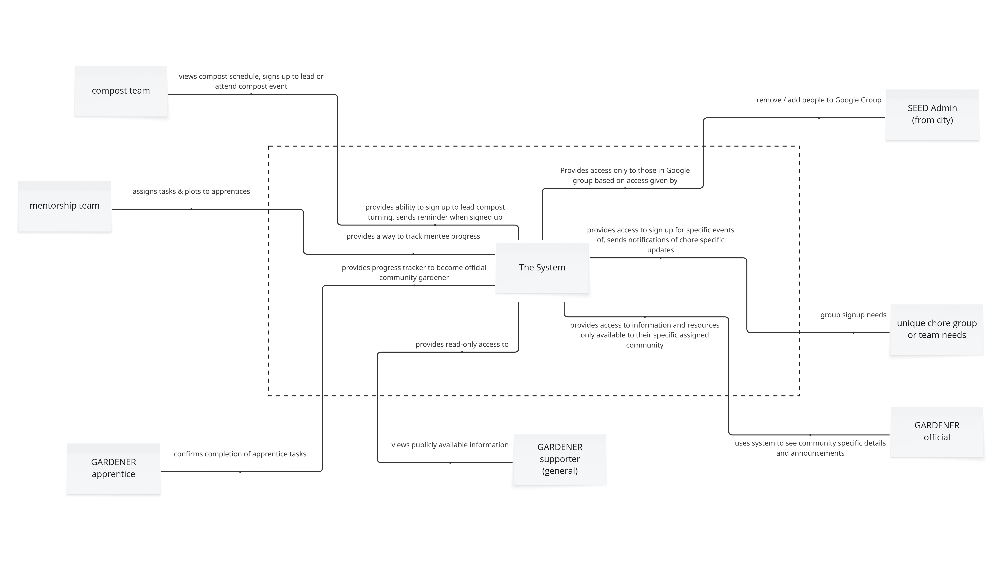

# General Requirements

This requirements file will outline the overall project requirements for the gardening app.

This project started out as a pet project for someone who joined a community garden group, was very new to gardening, and couldn't find an app that met her needs. It grew as she thought about how to make it easier for others in her Community Garden & how it might help others around the globe.

It is an open source project so anyone can use it, but if you like the work please consider donating to support the developer.

Moving forward, please note that the "I" mentioned in documentation is from the personal viewpoint of the developer.

## Project Description

<!-- --8<-- [start:Project-Description] -->

I am part of a local community garden where we grow food for local food pantries. In our community garden, we have supporters (who are not official gardeners but support with chores and teams), gardener apprentices who must complete a training program before they can be official gardeners, official gardeners who are like supporters but also have at least 1 plot they are in charge of, and then the city official(s) who manage the Google group for discussion and anything we need from the city.

Our community garden is fairly “old school” and leverages a Google group that some people may or may not be a part of. Often it can be difficult to try to plan for plots throughout the year let alone work on volunteer teams - especially for new gardeners.

We need a simple system that allows for easy garden planning as well as a secure system to collaborate on needs within the community.

<!-- --8<-- [end:Project-Description] -->

### What the Solution Should Do

Below is a list of high level things the solution should do. As the rest of the requirements and specifications are built out, it may do more than this over time. (The project will be completed in such a manner as is prioritized by the [stakeholders](#stakeholders).)

- Provide a way to pull data about specific plants based on the user’s USDA zone

- Provide information about a specific plant (e.g.: scientific name, germination time, size, etc) that is easy to locate, digest, and utilize

- Provide notifications to protect plants based on local weather conditions

- Provide information about the sun trajectory and light angle for planning of beds based on current / specific location

- Provide for a way to more easily find plants to work with based on time of year, zone, plant type, etc

- Provide for a way to add additional plants without having duplicates (e.g.: automated way to create tickets / solutions)

- Provide possible nursery and gardening store locations based on current location

- Create a secure location for local community gardener members to understand where they are in their journey

- Have a central communication tool for community garden announcements that won't be lost in emails

- Be open source so others can improve and support community

## Stakeholders

<!-- --8<-- [start:Stakeholders] -->

Here you will find the list of stakeholders and how they are expected to impact the design or use of the system.

1. Volunteer developers

2. Gardeners of all experience levels

    - New “budding” gardeners / Community Garden apprentices
    
    - Master Gardeners
    
    - “Local” gardeners (relative to given location)
    
    - Community Gardeners (general gardeners)
    
    - Community Gardeners (apprentices)
    
    - Community Gardeners (supporters)
    
    - Community Gardeners (specific teams)

    - Community Gardeners (specific chore groups)

3. People looking for gardening apps or tools to improve their knowledge & experience

4. Local nurseries & “big box” stores

5. Plants to be grown or tended to

<!-- --8<-- [end:Stakeholders] -->

## Context Diagrams

The Miro links will always contain the latest versions of the below.

### Main Context Diagram (General Use)

This diagram below can be found at the [general context diagram](../diagrams/REQ000/context-general.md#main-all-users) section.

### Community Gardener Diagram

This diagram can be found at the [community gardener context diagram](../diagrams/REQ000/context-general.md#community-gardener-special-user-access) section.

## Scenarios and Use Cases

Be sure to review [REQ-000b_Scope.md](./REQ-000b_Scope.md) for this information.