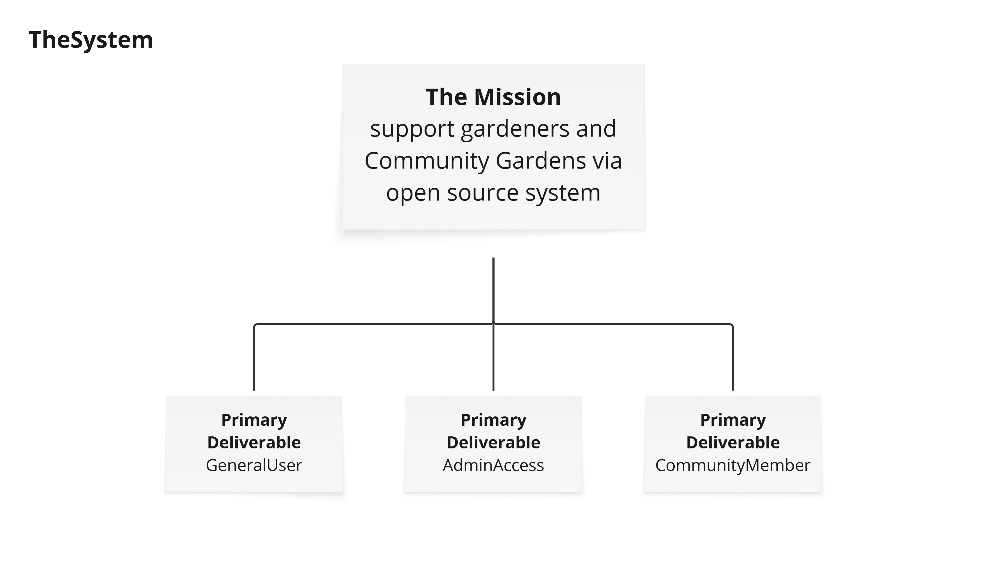
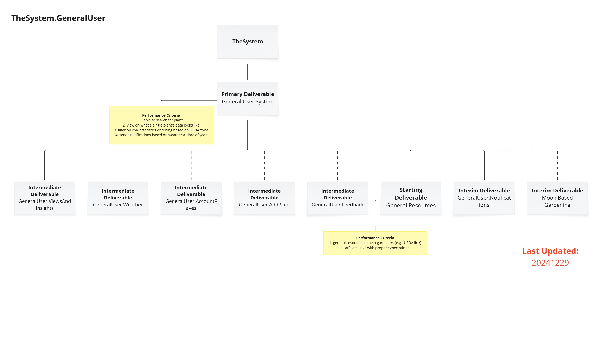
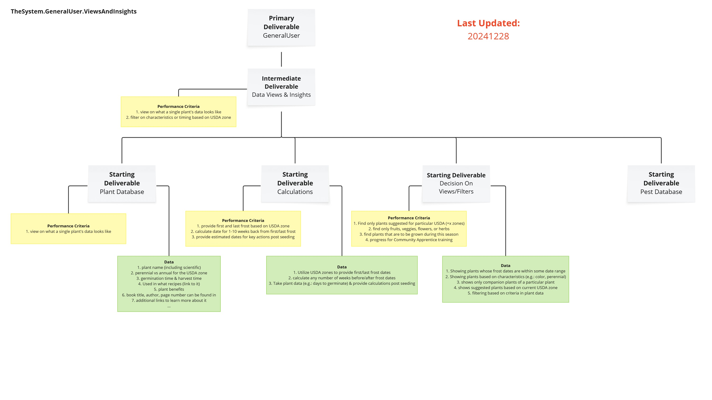
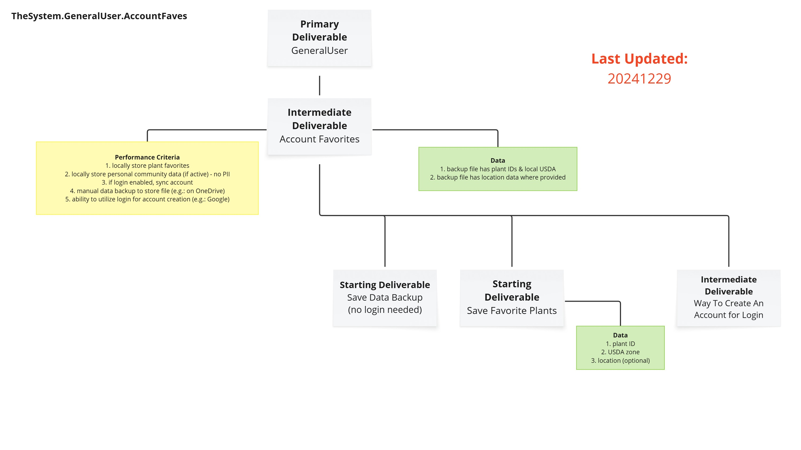
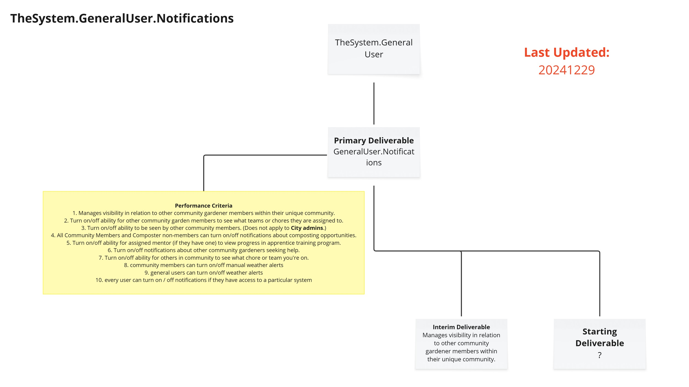
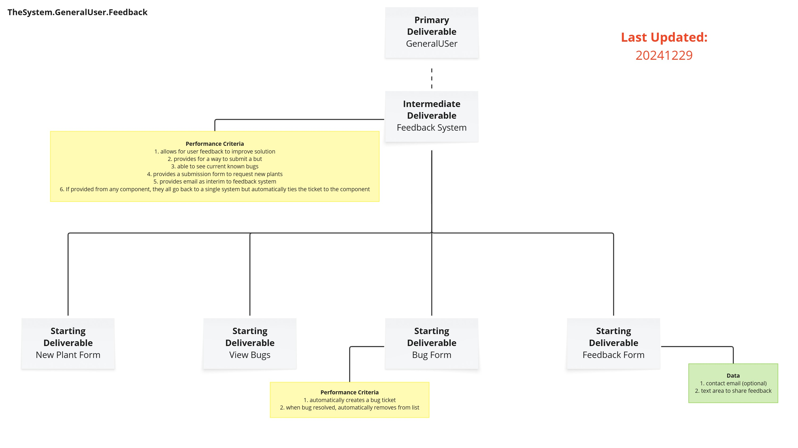
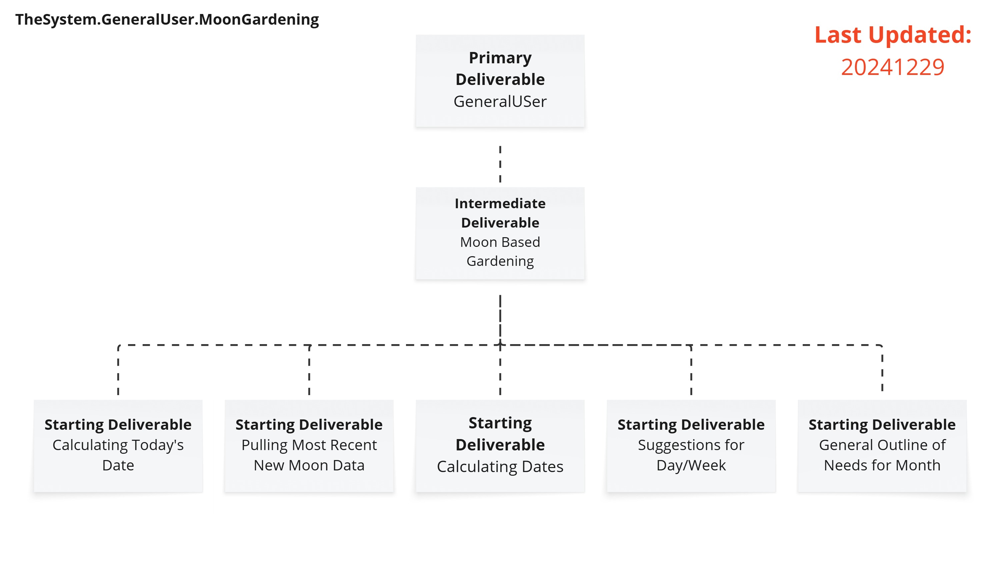
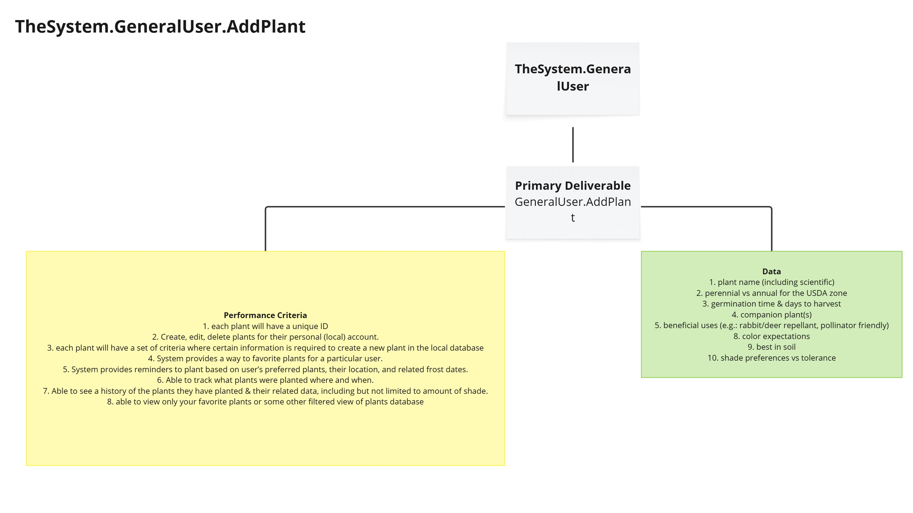
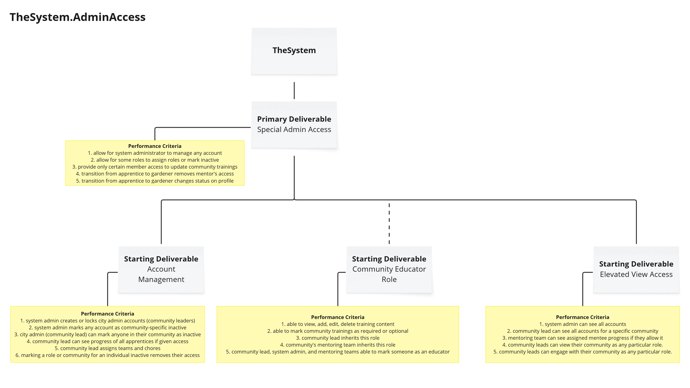
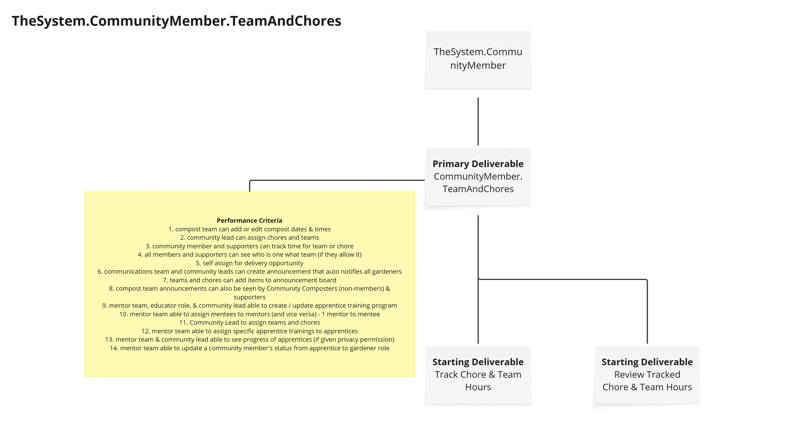

# Scope

## Scenarios

This section will outline the key scenarios already confirmed for completion with this application. They are not currently sorted in any particular order as of 20251224.

1.	Automatically receiving weather alerts when certain thresholds are hit

2.	Checking planting dates as estimated by the system based on USDA zone

3.	Viewing historical weather data for local area

4.	Viewing the system options

5.	Adding plants to the system

6.	Finding local nurseries and gardening supply stores via the system

7.	Viewing angle of the sun based on time of year and location

8.	Viewing plant data in the system

9.	Searching the system for plants to grow based on different criteria

10.	Updating plant data in the system

11.	Deleting plant data in the system

12.	Tracking what plants were planted where (e.g.: front yard) and when via the system

13.	Viewing companion plants as outlined in the system

14.	Updating companion plant data in the system

15.	Adding your current location in the system (if not using GPS)

16.	Viewing growing / gardening tips via the system (per plant, general care, etc)

17.	Providing feedback on the system

18.	Submitting bug issues in the system

19.	Emailing plant data to someone via the system

20.	Finding companion plants for specific plants via the system

21.	Providing helpful hints when “errors” happen in the system

22.	Provides access to training modules (PCG only)

23.	Provides training progress to gardening mentors

These scenarios were developed into use cases as outlined in [REQ-000c (Use Cases)](/docs/requirements/REQ-000c_UseCases.md).

## Scope Tree

Below is the scope tree attempt utilizing the [use cases](/docs/requirements/REQ-000c_UseCases.md) provided. They were all included for performance criteria understanding.

### The System (High Level View)

This shows the major components within the system. This is definitely different from the original expectations, and even up to the point of publishing this paper! It was fascinating to see in real time how this time consuming process could clarify & simplify.

The below information comes from [this Miro frame](https://miro.com/app/board/uXjVLFJo2wg=/?moveToWidget=3458764607916939205&cot=14).

---

### Primary Deliverable:  General User Access

This dives down into the **GeneralUser** sub-system and comes from [this Miro frame](https://miro.com/app/board/uXjVLFJo2wg=/?moveToWidget=3458764607914407243&cot=14).

Performance Criteria for General User module:

1. able to search for plant
2. view on what a single plant's data looks like
3. filter on characteristics or timing based on USDA zone
4. sends notifications based on weather & time of year
5. able to save favorite plants locally or as part of a registered account
6. provide supportive resources for gardeners
7. provide suggestions based on moon phase and location

Intermediate Deliverables (ordered by priority):

1. [Views & Insights](#views--insights)
2. [General Resources](#general-resources)
3. [Account Favorites](#account-favorites)
4. [Weather](#weather)
5. [Notifications](#notifications)
6. [Feedback](#feedback)
7. [Moon-Based Gardening](#moon-based-gardening)
8. [Add Plant](#add-plant)

#### Views & Insights

> _Return to main **GeneralUser** component [here](#primary-deliverable--general-user-access)_

This subsection dives down into **TheSystem.GeneralUser.ViewsAndInsights** component and comes from [this Miro frame](https://miro.com/app/board/uXjVLFJo2wg=/?moveToWidget=3458764607914535425&cot=14).

This subsystem has 4 starting deliverables, organized by priority:

1. [Plant Database](#starting-deliverable--plant-database)
2. [Calculations](#starting-deliverable--calculations)
3. [Decision on Views / Filters](#starting-deliverable--decision-on-views--filters)
4. [Pest Database](#starting-deliverable--pest-database)

**Performance Criteria:**

1. view on what a single plant's data looks like
2. filter on characteristics or timing based on USDA zone

##### Starting Deliverable:  Plant Database

> _Return to Views & Insights subcomponent [here](#views--insights)_

This is the core of the entire system. Below you will find high level expectations for the scope of this component.

**Performance Criteria:**

1. view on what a single plant's data looks like

**Data Needs:**

1. plant name (including scientific)
2. perennial vs annual for the USDA zone
3. germination time & harvest time
4. Used in what recipes (link to each)
5. plant benefits (e.g.:  rabbit resistant, hummingbird attractor)
6. book title, author, page number can be found in (could have multiple book references)
7. additional links to learn more about it
8. plant color(s)
9. soil type options (what they are & which one is best for the related plant)

##### Starting Deliverable:  Calculations

This is to help determine specific gardening times throughout the year, based on a given location or growing zone. Below you will find high level expectations for the scope of this component.

**Performance Criteria:**

1. provide first and last frost based on USDA zone
2. calculate date for 1-10 weeks back from first/last frost
3. provide estimated dates for key actions post seeding

**Data Needs:**

1. Utilize USDA zones to provide first/last frost dates
2. calculate any number of weeks before/after frost dates
3. Take plant data (e.g.: days to germinate) & provide calculations post seeding
4. today's date and location to determine moon phases per [Moon Gardening](#moon-based-gardening)

##### Starting Deliverable:  Decision on Views / Filters

This is to help locate the right plants. Below you will find high level expectations for the scope of this component.

**Performance Criteria:**

1. Find only plants suggested for particular USDA (+x zones)
2. find only fruits, veggies, flowers, or herbs
3. find plants that are to be grown during this season
4. progress for Community Apprentice training

**Data Needs:**

1. Showing plants whose frost dates are within some date range
2. Showing plants based on characteristics (e.g.: color, perennial)
3. shows only companion plants of a particular plant
4. shows suggested plants based on current USDA zone
5. filtering based on criteria in plant data

##### Starting Deliverable:  Pest Database

This is to help gardeners with pests in their area and how to organically treat for them.

As this has not yet been planned out as of 20251224, you will not yet find the high level expectations for the scope of this component.

**Performance Criteria:**

1. TBD

**Data Needs:**

1. TBD

#### General Resources

> _Return to main **GeneralUser** component [here](#primary-deliverable--general-user-access)_

This section has not been completely thought through - likely a page with links. May need to be moved to [Views & Insights](#views--insights) subsystem deliverable.

**Performance Criteria:**

1. general resources to help gardeners (e.g.: USDA link)
2. affiliate links with proper expectations

**Data Needs:**

1. TBD

#### Account Favorites

> _Return to main **GeneralUser** component [here](#primary-deliverable--general-user-access)_

This work has been de-prioritized, but some of it has been planned out as a preparatory step.

The below image comes from [this](https://miro.com/app/board/uXjVLFJo2wg=/?moveToWidget=3458764607917083938&cot=14) Miro frame:

**Performance Criteria:**

1. locally store plant favorites
2. locally store personal community data (if active) - no PII
3. if login enabled, sync account
4. manual data backup to store file (e.g.: on OneDrive)
5. ability to utilize login for account creation (e.g.: Google)

**Data Needs:**

1. backup file has plant IDs & local USDA
2. backup file has location data where provided

**Starting Deliverables:**

1. [Save Data Backup - LOCAL](#starting-deliverble--save-data-backup---local) (no login needed)
2. [Save Plant Favorites](#starting-deliverble--save-plant-favorites)
3. [Create Account or Login](#starting-deliverble--create-account-or-login)

##### Starting Deliverble:  Save Data Backup - LOCAL

?

**Data Needs:**

1. unique user ID
2. USDA zone (or similar for their country)
3. location (optional)

##### Starting Deliverble:  Save Plant Favorites

?

**Data Needs:**

1. unique user ID
2. plant ID

##### Starting Deliverble:  Create Account or Login

?

**Data Needs:**

1. unique user ID (based on account integration)

#### Weather

> _Return to main **GeneralUser** component [here](#primary-deliverable--general-user-access)_

Due to the intricacy of this need, only the performance criteria have been thought out for this subsystem as of 20251224.

The current Miro frame is [here](https://miro.com/app/board/uXjVLFJo2wg=/?moveToWidget=3458764608030483731&cot=14).

**Performance Criteria:**

1. Connects to a Weather API (or using web scraping) that pulls current and historical weather data
2. provide warnings & suggestions for mitigating inclement weather risks
3. when current or upcoming weather indicates need for plant support, notification sent (if user turned on)
4. when weather indicates need for plant support, creates a weather announcement that deletes 24H later
5. communications team can manually delete weather alerts
6. community leader and communications team can manually send weather announcements & notifications
7. if provided, utilizes location data for more accurate weather information
8. if user wants to provide feedback from this module, it will leverage feedback module & tie to weather module
9. View suggestions for upcoming protection planning based on weather predictions (up to 1 week out)
10. if turned on, checks daily - otherwise on first system access of the day via weather API or manual refresh
11. general user able to see current and forecasted weather as per most recent sync
12. limit weather sync to 2x / hour unless they provide their own API information
13. if not connected to the weather API, message should indicate status
14. when available, provides historical weather to show average hot/cold and precipitation for each month

#### Notifications

> _Return to main **GeneralUser** component [here](#primary-deliverable--general-user-access)_

This work has been de-prioritized, but some of it has been planned out as a preparatory step.

The below image comes from [this](https://miro.com/app/board/uXjVLFJo2wg=/?moveToWidget=3458764607920479639&cot=14) Miro frame:

**Performance Criteria:**

1. Manages visibility in relation to other community gardener members within their unique community.
2. Turn on/off ability for other community garden members to see what teams or chores they are assigned to.
3. Turn on/off ability to be seen by other community members. (Does not apply to City admins.)
4. All Community Members and Composter non-members can turn on/off notifications about composting opportunities.
5. Turn on/off ability for assigned mentor (if they have one) to view progress in apprentice training program.
6. Turn on/off notifications about other community gardeners seeking help.
7. Turn on/off ability for others in community to see what chore or team you're on.
8. community members can turn on/off manual weather alerts
9. general users can turn on/off weather alerts
10. every user can turn on / off notifications if they have access to a particular system

#### User Feedback

> _Return to main **GeneralUser** component [here](#primary-deliverable--general-user-access)_

This work has been de-prioritized, but some of it has been planned out as a preparatory step.

Below image comes from [this](https://miro.com/app/board/uXjVLFJo2wg=/?moveToWidget=3458764607916742999&cot=14) Miro frame:

**Performance Criteria:**

1. allows for user feedback to improve solution
2. provides for a way to submit a but
3. able to see current known bugs
4. provides a submission form to request new plants
5. provides email as interim to feedback system
6. If provided from any component, they all go back to a single system but automatically ties the ticket to the component

**Starting Deliverables:**

1. New Plant Form
2. View Bugs
3. Bug Submission Form
4. Feedback Form

#### Moon-Based Gardening

> _Return to main **GeneralUser** component [here](#primary-deliverable--general-user-access)_

At this time, this portion has not been planned for yet. It is a nice to have and should be designed before implementing.

The image below comes from [this](https://miro.com/app/board/uXjVLFJo2wg=/?moveToWidget=3458764611900448136&cot=14) Miro frame:

**Starting Deliverables:**

1. Calculate today's date (part of [Calculations](#starting-deliverable--calculations) requirements) to determine phase of moon
2. pull most recent new moon data
3. calculate dates from new moon
4. gardening suggestions for the day/week based on moon phase
5. general outline needs for the month based on moon phases

#### Add Plant

> _Return to main **GeneralUser** component [here](#primary-deliverable--general-user-access)_

This is last due to complexity for an automated system. Otherwise it must be updated through the repo and manually updated for PROD.

**Performance Criteria:**

1. each plant will have a unique ID
2. Create, edit, delete plants for their personal (local) account.
3. each plant will have a set of criteria where certain information is required to create a new plant in the local database
4. System provides a way to favorite plants for a particular user.
5. System provides reminders to plant based on user’s preferred plants, their location, and related frost dates.
6. Able to track what plants were planted where and when.
7. Able to see a history of the plants they have planted & their related data, including but not limited to amount of shade.
8. able to view only your favorite plants or some other filtered view of plants database

**Data Needs:**

1. plant name (including scientific)
2. perennial vs annual for the USDA zone
3. germination time & days to harvest
4. companion plant(s)
5. beneficial uses (e.g.: rabbit/deer repellant, pollinator friendly)
8. color expectations
9. best in what soil type
10. shade preferences vs tolerance

---

### Primary Deliverable:  Elevated User Access

This is currently de-prioritized as of 20251224. The basic requirements should be built first before trying to add new access or elevated privileges, which add security risk to threat assessment.

The current section dives down into the **AdminAccess** sub-system and comes from [this](https://miro.com/app/board/uXjVLFJo2wg=/?moveToWidget=3458764607918743564&cot=14) Miro frame.

**Performance Criteria:**

1. allow for system administrator to manage any account
2. allow for some roles to assign roles or mark inactive
3. provide only certain member access to update community trainings
4. transition from apprentice to gardener removes mentor's access
5. transition from apprentice to gardener changes status on profile

**Starting Deliverables:**

1. [Account Management](#starting-deliverable--account-management)
2. [Community Educator Role](#starting-deliverable--community-educator-role)
3. [Elevated View Access](#starting-deliverable--elevated-view-access)

#### Starting Deliverable:  Account Management

**Performance Criteria:**

1. system admin creates or locks city admin accounts (community leaders)
2. system admin marks any account as community-specific inactive
3. city admin (community lead) can mark anyone in their community as inactive
4. community lead can see progress of all apprentices if given access
5. community lead assigns teams and chores
6. marking a role or community for an individual inactive removes their access

#### Starting Deliverable:  Community Educator Role

**Performance Criteria:**

1. able to view, add, edit, delete training content
2. able to mark community trainings as required or optional
3. community lead inherits this role
4. community's mentoring team inherits this role
5. community lead, system admin, and mentoring teams able to mark someone as an educator

#### Starting Deliverable:  Elevated View Access

**Performance Criteria:**

1. system admin can see all accounts
2. community lead can see all accounts for a specific community
3. mentoring team can see assigned mentee progress if they allow it
4. community leads can view their community as any particular role.
5. community leads can engage with their community as any particular role.

### Primary Deliverable:  General Community Member Access

This dives down into the **CommunityMember** sub-system and comes from [this](https://miro.com/app/board/uXjVLFJo2wg=/?moveToWidget=3458764607919600206&cot=14) Miro frame.

**Performance Criteria:**

1. only those accounts assigned to a community can see the community specific data
2. some areas only able to be updated by particular roles (e.g.: compost turning days)
3. able to turn on/off community notifications
4. able to switch between communities

**Interim Deliverables:**

1. [Apprentive Program](#apprentice-program)
2. [Announcements](#announcements)
3. [Team & Chores](#team--chores)
4. [Plot Assignment System](#plot-assignment-system)

#### Apprentice Program

**Performance Criteria:**

1. Community Lead, supporter, apprentice, and official gardener all inherit from member role
2. Educator role able to see, edit, and delete training materials for community
3. mentors can view assigned mentee apprentice progress (if they allow it)
4. able to view all community training materials & progress through program
5. assigned mentor can highlight training for apprentice with tentative deadline
5. able to mark self as completed for required / optional community apprentice tasks
7. able to view when completed tasks

#### Announcements

**Performance Criteria:**

1. all members and supporters able to see who is delivering when and where
2. all community members & supporters can access announcements area
3. visual cues to show different announcement types (e.g.: plot availability vs compost turning)
4. only able to see announcements for their assigned community
5. turn on/off levels of announcements (e.g.: compost, etc)
6. no one outside community can see community's announcements
7. announcement to include title, description, date posted, date to cancel announcement
8. way to choose an announcement for a specific team or chore
9. all community members can add to announcement board but they don't auto notify
10. announcements made by chores or teams have a special designation from comms team
11. announcement submissions require a title, start & end date, description, and POC
12. central location for all announcements (that can be filtered) and auto expire based on submission
13. special visual aspect related to training opportunities required for apprentices
14. workday list is viewable by all members, editable by apprentices & gardeners & community lead
15. edit and deletion of workday items is only to those that posted it or the  community lead
16. if plot management requests are approved or denied, requester is notified
17. mentor team and plot manager roles are notified of plot change requests / releases
18. plot assignment or support status changes the member is notified

##### Starting Deliverable:  Announcement Board

Only accessible by the related community. More to be planned.

All community members and compost non-members able to view all available compost turning dates & times. (Possibly need a chore or team to-do list?)

##### Starting Deliverable:  Workday Needs

**Performance Criteria:**

1. Add to monthly workday list things that need to be done in the community garden.
2. view list from all members who added help needs for workday
3. able to edit their own entry for workday list
4. able to be added to by any community member
5. Only stores last 3 workday sessions for easy planning
6. able to mark which items complete
7. tracks % complete of planned workday tasks

#### Team & Chores

Not yet fully fleshed out as of December 2024.

The below image is from [this](https://miro.com/app/board/uXjVLFJo2wg=/?moveToWidget=3458764607919600556&cot=14) Miro frame.

**Performance Criteria:**

1. compost team can add or edit compost dates & times
2. community lead can assign chores and teams
3. community member and supporters can track time for team or chore
4. all members and supporters can see who is one what team (if they allow it)
5. self assign for delivery opportunity
6. communications team and community leads can create announcement that auto notifies all gardeners
7. teams and chores can add items to announcement board
8. compost team announcements can also be seen by Community Composters (non-members) & supporters
9. mentor team, educator role, & community lead able to create / update apprentice training program
10. mentor team able to assign mentees to mentors (and vice versa) - 1 mentor to mentee
11. Community Lead to assign teams and chores
12. mentor team able to assign specific apprentice trainings to apprentices
13. mentor team & community lead able to see progress of apprentices (if given privacy permission)
14. mentor team able to update a community member's status from apprentice to gardener role

**Starting Deliverables:**

1. track chore hours
2. track team hours
3. review tracked hours

#### Plot Assignment System

Current scope tree Miro frame is [here](https://miro.com/app/board/uXjVLFJo2wg=/?moveToWidget=3458764608029447994&cot=14).

**Performance Criteria:**

1. only gardeners and apprentices can manage a plot - supporters support gardeners / apprentices
2. any community member can be a supporter for a bed or chore
3. people on a chore are automatically "assigned" the support role for that chore
4. able to see vacant plots to request management for
5. able to see supporters for a particular plot or chore (to determine what may need more help)
6. mentor team and community lead able to see plot management and support requests
7. members & supporters can see all of their own requests
8. gardeners and apprentices can see plots available to manage
9. members and supporters can see plots or chores needing support
10. members and supporters can request to support a bed or chore
?. gardeners and apprentices can request to manage a plot
?. mentor team and plot manager roles approve or deny management requests
?. if plot management requests are approved or denied, requester is notified
11. when a chore community member requests support, that plot/chore will have a temporary support flag
12. when support is requested, it can be found in announcements
13. when support is requested, a notification will be sent to those who have it turned on
14. members & supporters can see plots / chores they manage / support
15. members can see all plot details
16. mentor team & plot manager roles able to manually add/change/remove plot/chores manager/supporter
17. when plot manager / supporter role is fille and there is a related announcement, announcement is deleted
18. system announcement created when plot is abandoned (no notification)
19. plot system includes related chores (e.g.: orchards)
20. eventually plot / chore managers able to mark what is growing in a plot area that all members can view
