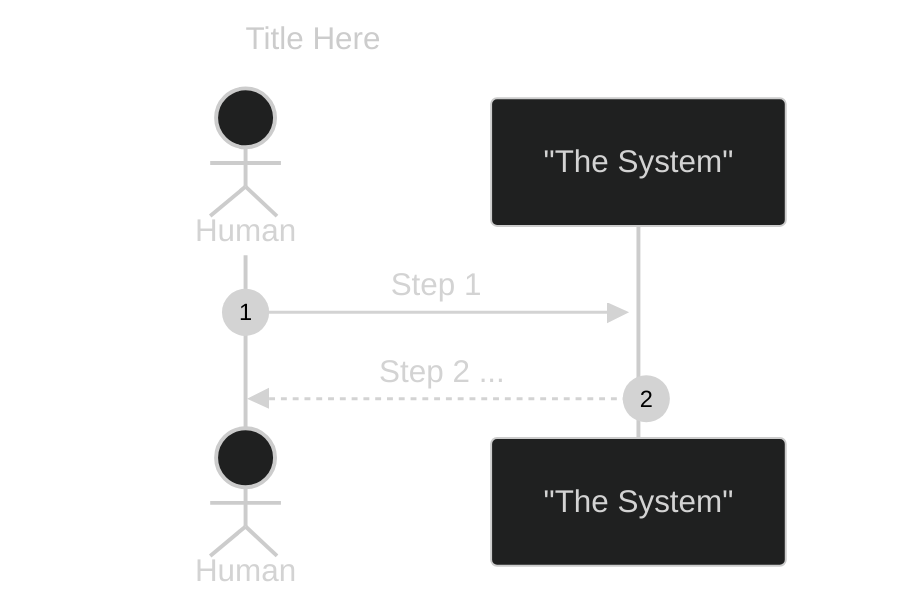
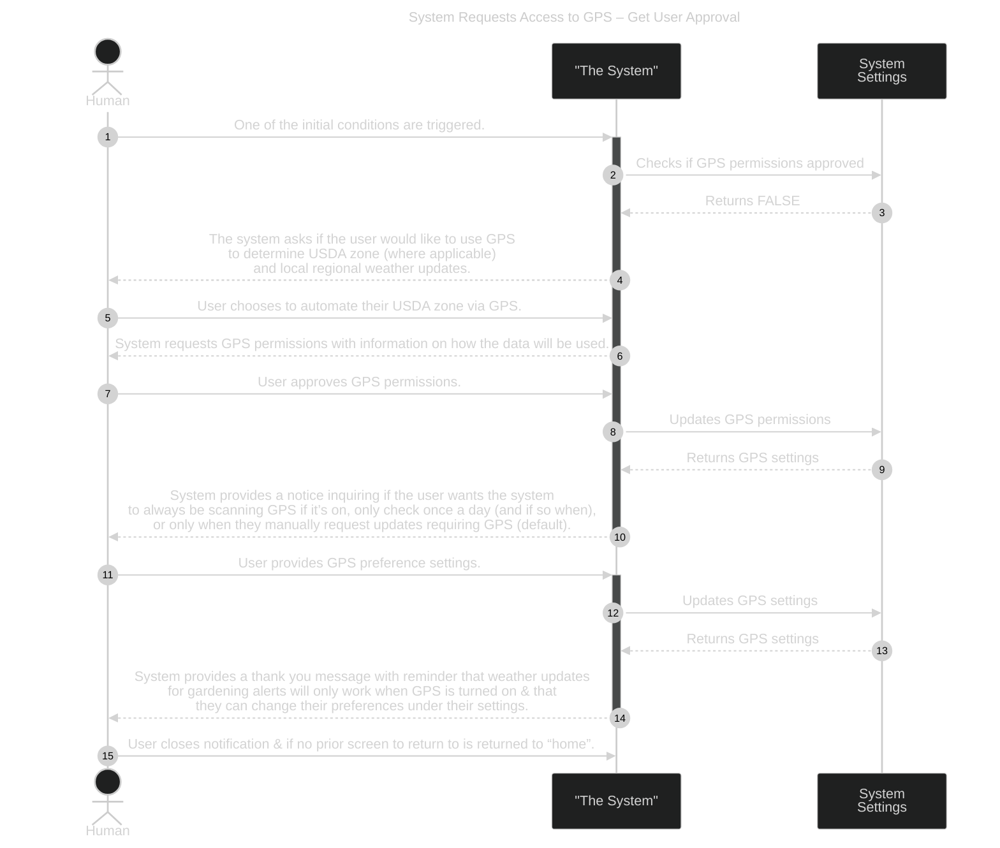
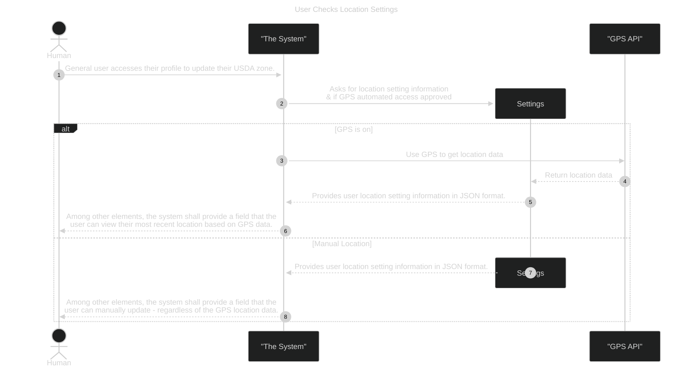
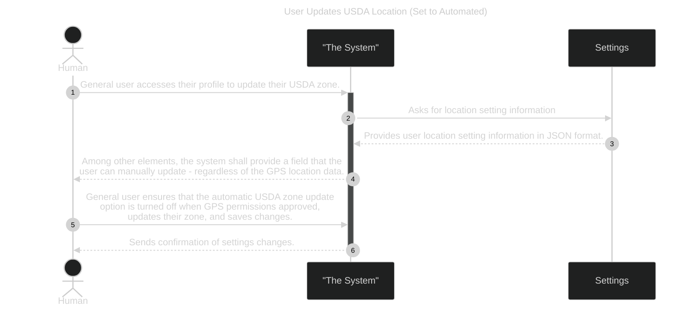

# Use Case Behavior Diagrams

This file is a continuation of the [Use Cases](./REQ-000c_UseCases.md) file. It will provide the behavior diagrams of the different use cases.

This section is not yet complete as of December 2024. This is a working document, as progression is made throughout the solution based on prioritized work.

Excluding the [Guidelines](#ucbd-guidelines) & [Template](#ucbd-template) sections, each section below relates to a specific sub-system as outlined in the [Scope Tree](/docs/requirements/REQ-000b_Scope.md#scope-tree):

1.	General User

2.	Admin Access

3.	Community Member

## Identifying Top High Priority Use Cases

When identifying high use case needs for this course, consider ones that:

- Directly address stakeholder's primary needs

- Have a significant influence on the performance of your system

- Address situations considered to be high risk, including ones that focus on undesired occurrences

- Require your system to perform complex and important tasks

- Occur very frequently

The XLSX for this is here.

| PRIORITY | ACTOR | ACTION | How Critical? (H/M/L) | UC Diagram (miro) | UCBD |
| --- | --- | --- | --- | --- | --- |
| 1 | general system user | Searches for information on a specific plant. | High | [here](https://miro.com/app/board/uXjVLFJo2wg=/?moveToWidget=3458764607290502924&cot=14) | Plant Search |
| 2 | general system user | Provides feedback or reports an error | High | [here](https://miro.com/app/board/uXjVLFJo2wg=/?moveToWidget=3458764607290502924&cot=14) | 1. Gives Feedback 2. Reports Error |
| 3 | System admin | Manages all accounts | High | [here](https://miro.com/app/board/uXjVLFJo2wg=/?moveToWidget=3458764607727412356&cot=14) | 1. Create Community Lead 2. Add Community Lead 3. Make Account Inactive for Specific Community 4. Create general user account 5. Delete account |
| 4 | System admin | Creates city admin accounts | High | [here](https://miro.com/app/board/uXjVLFJo2wg=/?moveToWidget=3458764607727412356&cot=14) | See #3’s #1 |
| 5 | Gardener – Community (member) | Access community announcements. | High | [here](https://miro.com/app/board/uXjVLFJo2wg=/?moveToWidget=3458764607446135000&cot=14) | Access Announcements |
| 6 | Gardener – Community (member) | Includes all **general system user** actions & access is based on a unique community ID | High | [here](https://miro.com/app/board/uXjVLFJo2wg=/?moveToWidget=3458764607446135000&cot=14) | ? |
| 7 | general system user | Cannot access any community-specific training, materials, or special information that only members or specific teams can see UNLESS they are also a member of that community. | High | [here](https://miro.com/app/board/uXjVLFJo2wg=/?moveToWidget=3458764607290502924&cot=14) | ? |
| 8 | City Admin – Community Lead | Assigns teams & chores to their community gardeners. | High | [here](https://miro.com/app/board/uXjVLFJo2wg=/?moveToWidget=3458764607735882431&cot=14) | ? |
| 9 | Gardener – Community (member) | Turn on/off ability to be seen by other community members. (Does not apply to **City admins**.) | High | [here](https://miro.com/app/board/uXjVLFJo2wg=/?moveToWidget=3458764607446135000&cot=14) | ? |
| 10 |  | System provides a way to filter plants based on user selection criteria (e.g.: color, seeding date, etc) | High | [here](https://miro.com/app/board/uXjVLFJo2wg=/?moveToWidget=3458764607290502924&cot=14) | Plant Filtering |

## UCBD Guidelines

1.	Write as shall statements

2.	Write as correct statements (what you’re saying is accurate)

3.	Write clear & precise statements
    - One idea per requirement
    - If “and” or similar conjunction in requirements, considered better to split

4.	Write unambiguous statements (only 1 way to interpret)

5.	Write objective statements (if anything is subjective, qualify with some quantifiable measure)

6.	Write verifiable statements (some measurable way to say requirement is met)

7.	Write consistent statements (does not contradict another requirement)

Some organizations may also include the following as their best practices:

1.	Implementation independent (functional, not structural)

2.	Achievable (feasible)

3.	Conforming (consistent with regulations imposed by stakeholders & any other governing entity)

## UCBD Template

_**NOTE:**  Utilize mermaid documentation [here](https://mermaid.js.org/syntax/sequenceDiagram.html) when designing your SysML to work within MarkDown and on GitHub_

**Use Case Name:**  TBD

**Initial Conditions:**

1. TBD

 

**Ending Conditions:**

1. TBD

**Notes:**

1. TBD

**Identifying Missed Functionality:**

| Additional Grouping of Requirements | Description |
| ----------------------------------- | ----------- |
| \* | “Functionality 1” |
| \*\* | “Functionality 2” |
| \*\*\* | “Functionality 3” |

Identifying Missed Functionality – the system shall be able to:
- *item 1 of F1
- **item 1 of F2
- ***item 1 of F3

## SUBSYSTEM:  General User Actions

The subitems in this section all belong to the GeneralUser system actions set.

Below you will find the use case behavior diagrams for this subsystem.

As of Nov 29, 2024 – this is not complete only parts were needed at the time of creation and part of a Systems Design certification course. As work progresses, this will continue to be updated.

**UCBDs for General User Actions:**

1. [Set GPS Permissions](#set-gps-permissions)
2. [User Checks Location Settings](#updating-usda-location--manual)
3. [Plant Search](#plant-search)

### Set GPS Permissions

**Use Case Name:**  System Requests Access to GPS – Get User Approval

**Initial Conditions:**

1. First time running the system as a new user or user tries to use GPS modules within the app (e.g.: checking weather, turning on weather-based gardening notifications) without permissions

**Mermaid Diagram:**

 

**Ending Conditions:**

1. GPS permissions are turned on
2. Unique user’s profile has auto-update USDA zone turned on
3. Unique user’s USDA zone field is filled in and user unable to edit
4. Unique user’s profile settings are set to user’s preference and editable in their profile

**Notes:**

1. Need to create a general system UCBD for when user declines.
2. Need to ensure that use case diagrams & scope trees are updated, as the GPD settings is new.
3. “home” is either their profile or an area user can locate all components they have access to.

**Identifying Missed Functionality:**

| Additional Grouping of Requirements | Description |
| ----------------------------------- | ----------- |
| \* | “System checks for approval” |
| \*\* | “System notifies user” |
| \*\*\* | “System uses GPS data for weather or USDA zone needs” |

Identifying Missed Functionality – the system shall be able to:
- *Check if GPS permissions are approved
- **Notify user when GPS is required and not yet approved
- **If unable to connect to GPS, notify user
- **If unable to connect to GPS and no USDA zone saved, will force user to manually provide USDA zone
- ***(with proper permissions & based on frequency settings) automatically check GPS when attempting to pull current or past weather data
- ***will ensure either GPS or manual USDA zone is utilized

### User Checks Location Settings

**Use Case Name:**  User Checks Location Settings

**Initial Conditions:**

1. GPS is on and set to automatic update OR it is off
2. USDA zone is empty or USDA zone needs to be updated.

 

**Ending Conditions:**

1. Unique user’s profile is set to manually update USDA zone
2. USDA zone has been updated and saved

**Notes:**

1. By default, automating USDA zone by GPS location should be turned off.
2. Profile can be accessed from anywhere within the system.

**Identifying Missed Functionality:**

| Additional Grouping of Requirements | Description |
| ----------------------------------- | ----------- |
| \* | TBD |
| \*\* | TBD |
| \*\*\* | TBD |

Identifying Missed Functionality – the system shall be able to:
- *item 1 of F1
- **item 1 of F2
- ***item 1 of F3

### Plant Search

**Use Case Name:**  General User searches for plant

**Initial Conditions:**

1. USDA auto update is turned off in profile
2. Location is on, USDA zone is empty, or USDA zone needs to be updated.

 

**Ending Conditions:**

1. By default, automating USDA zone by GPS location should be turned on.
2. Profile can be accessed from anywhere within the system.

**Notes:**

1. By default, automating USDA zone by GPS location should be turned on.
2. Profile can be accessed from anywhere within the system.

**Identifying Missed Functionality:**

| Additional Grouping of Requirements | Description |
| ----------------------------------- | ----------- |
| \* | TBD |
| \*\* | TBD |
| \*\*\* | TBD |

Identifying Missed Functionality – the system shall be able to:
- *item 1 of F1
- **item 1 of F2
- ***item 1 of F3

### ?

**Use Case Name:**  TBD

**Initial Conditions:**

1. TBD

 

**Ending Conditions:**

1. TBD

**Notes:**

1. TBD

**Identifying Missed Functionality:**

| Additional Grouping of Requirements | Description |
| ----------------------------------- | ----------- |
| \* | “Functionality 1” |
| \*\* | “Functionality 2” |
| \*\*\* | “Functionality 3” |

Identifying Missed Functionality – the system shall be able to:
- *item 1 of F1
- **item 1 of F2
- ***item 1 of F3

### ?

**Use Case Name:**  TBD

**Initial Conditions:**

1. TBD

 

**Ending Conditions:**

1. TBD

**Notes:**

1. TBD

**Identifying Missed Functionality:**

| Additional Grouping of Requirements | Description |
| ----------------------------------- | ----------- |
| \* | “Functionality 1” |
| \*\* | “Functionality 2” |
| \*\*\* | “Functionality 3” |

Identifying Missed Functionality – the system shall be able to:
- *item 1 of F1
- **item 1 of F2
- ***item 1 of F3

### ?

**Use Case Name:**  TBD

**Initial Conditions:**

1. TBD

 

**Ending Conditions:**

1. TBD

**Notes:**

1. TBD

**Identifying Missed Functionality:**

| Additional Grouping of Requirements | Description |
| ----------------------------------- | ----------- |
| \* | “Functionality 1” |
| \*\* | “Functionality 2” |
| \*\*\* | “Functionality 3” |

Identifying Missed Functionality – the system shall be able to:
- *item 1 of F1
- **item 1 of F2
- ***item 1 of F3

### ?

**Use Case Name:**  TBD

**Initial Conditions:**

1. TBD

 

**Ending Conditions:**

1. TBD

**Notes:**

1. TBD

**Identifying Missed Functionality:**

| Additional Grouping of Requirements | Description |
| ----------------------------------- | ----------- |
| \* | “Functionality 1” |
| \*\* | “Functionality 2” |
| \*\*\* | “Functionality 3” |

Identifying Missed Functionality – the system shall be able to:
- *item 1 of F1
- **item 1 of F2
- ***item 1 of F3

### ?

**Use Case Name:**  TBD

**Initial Conditions:**

1. TBD

 

**Ending Conditions:**

1. TBD

**Notes:**

1. TBD

**Identifying Missed Functionality:**

| Additional Grouping of Requirements | Description |
| ----------------------------------- | ----------- |
| \* | “Functionality 1” |
| \*\* | “Functionality 2” |
| \*\*\* | “Functionality 3” |

Identifying Missed Functionality – the system shall be able to:
- *item 1 of F1
- **item 1 of F2
- ***item 1 of F3

## SUBSYSTEM:  Admin (Elevated User) Access

### ?

**Use Case Name:**  TBD

**Initial Conditions:**

1. TBD

 

**Ending Conditions:**

1. TBD

**Notes:**

1. TBD

**Identifying Missed Functionality:**

| Additional Grouping of Requirements | Description |
| ----------------------------------- | ----------- |
| \* | “Functionality 1” |
| \*\* | “Functionality 2” |
| \*\*\* | “Functionality 3” |

Identifying Missed Functionality – the system shall be able to:
- *item 1 of F1
- **item 1 of F2
- ***item 1 of F3

### ?

**Use Case Name:**  TBD

**Initial Conditions:**

1. TBD

 

**Ending Conditions:**

1. TBD

**Notes:**

1. TBD

**Identifying Missed Functionality:**

| Additional Grouping of Requirements | Description |
| ----------------------------------- | ----------- |
| \* | “Functionality 1” |
| \*\* | “Functionality 2” |
| \*\*\* | “Functionality 3” |

Identifying Missed Functionality – the system shall be able to:
- *item 1 of F1
- **item 1 of F2
- ***item 1 of F3

### ?

**Use Case Name:**  TBD

**Initial Conditions:**

1. TBD

 

**Ending Conditions:**

1. TBD

**Notes:**

1. TBD

**Identifying Missed Functionality:**

| Additional Grouping of Requirements | Description |
| ----------------------------------- | ----------- |
| \* | “Functionality 1” |
| \*\* | “Functionality 2” |
| \*\*\* | “Functionality 3” |

Identifying Missed Functionality – the system shall be able to:
- *item 1 of F1
- **item 1 of F2
- ***item 1 of F3

### ?

**Use Case Name:**  TBD

**Initial Conditions:**

1. TBD

 

**Ending Conditions:**

1. TBD

**Notes:**

1. TBD

**Identifying Missed Functionality:**

| Additional Grouping of Requirements | Description |
| ----------------------------------- | ----------- |
| \* | “Functionality 1” |
| \*\* | “Functionality 2” |
| \*\*\* | “Functionality 3” |

Identifying Missed Functionality – the system shall be able to:
- *item 1 of F1
- **item 1 of F2
- ***item 1 of F3

### ?

**Use Case Name:**  TBD

**Initial Conditions:**

1. TBD

 

**Ending Conditions:**

1. TBD

**Notes:**

1. TBD

**Identifying Missed Functionality:**

| Additional Grouping of Requirements | Description |
| ----------------------------------- | ----------- |
| \* | “Functionality 1” |
| \*\* | “Functionality 2” |
| \*\*\* | “Functionality 3” |

Identifying Missed Functionality – the system shall be able to:
- *item 1 of F1
- **item 1 of F2
- ***item 1 of F3

## SUBSYSTEM:  Community Member

This is not fully fleshed out at the moment, as there are some elevated user access to be considered.

### ?

**Use Case Name:**  TBD

**Initial Conditions:**

1. TBD

 

**Ending Conditions:**

1. TBD

**Notes:**

1. TBD

**Identifying Missed Functionality:**

| Additional Grouping of Requirements | Description |
| ----------------------------------- | ----------- |
| \* | “Functionality 1” |
| \*\* | “Functionality 2” |
| \*\*\* | “Functionality 3” |

Identifying Missed Functionality – the system shall be able to:
- *item 1 of F1
- **item 1 of F2
- ***item 1 of F3
