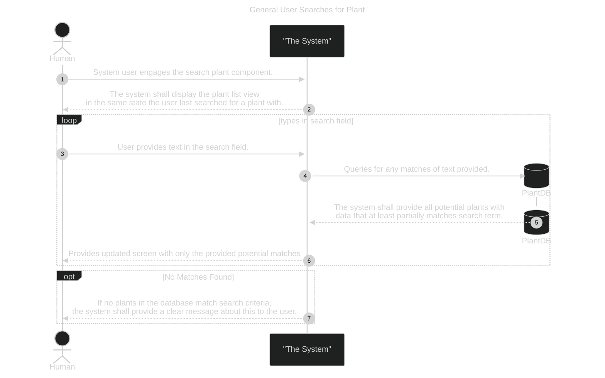
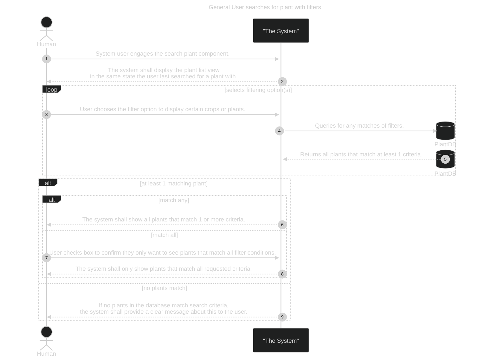
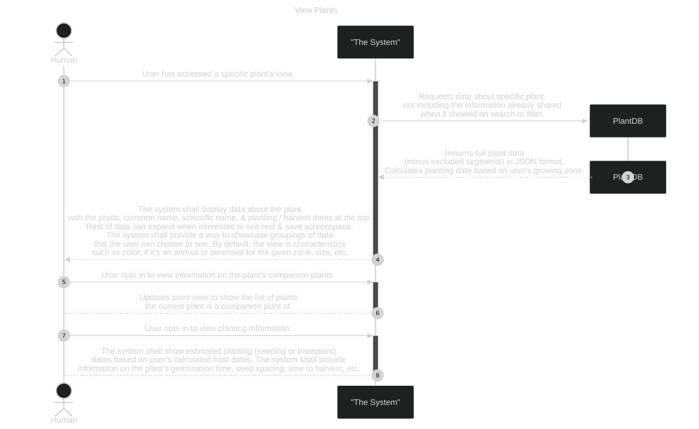
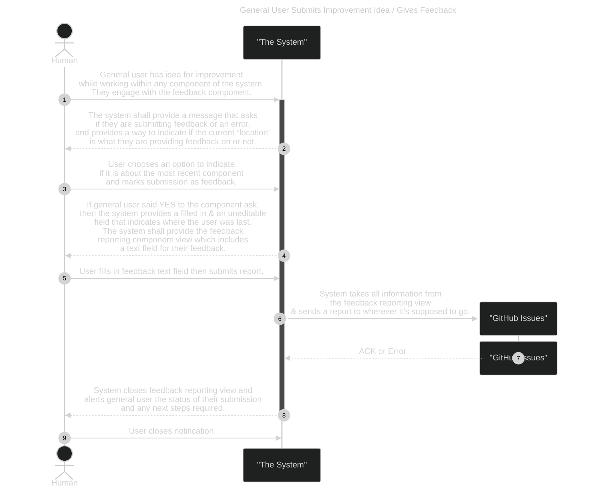
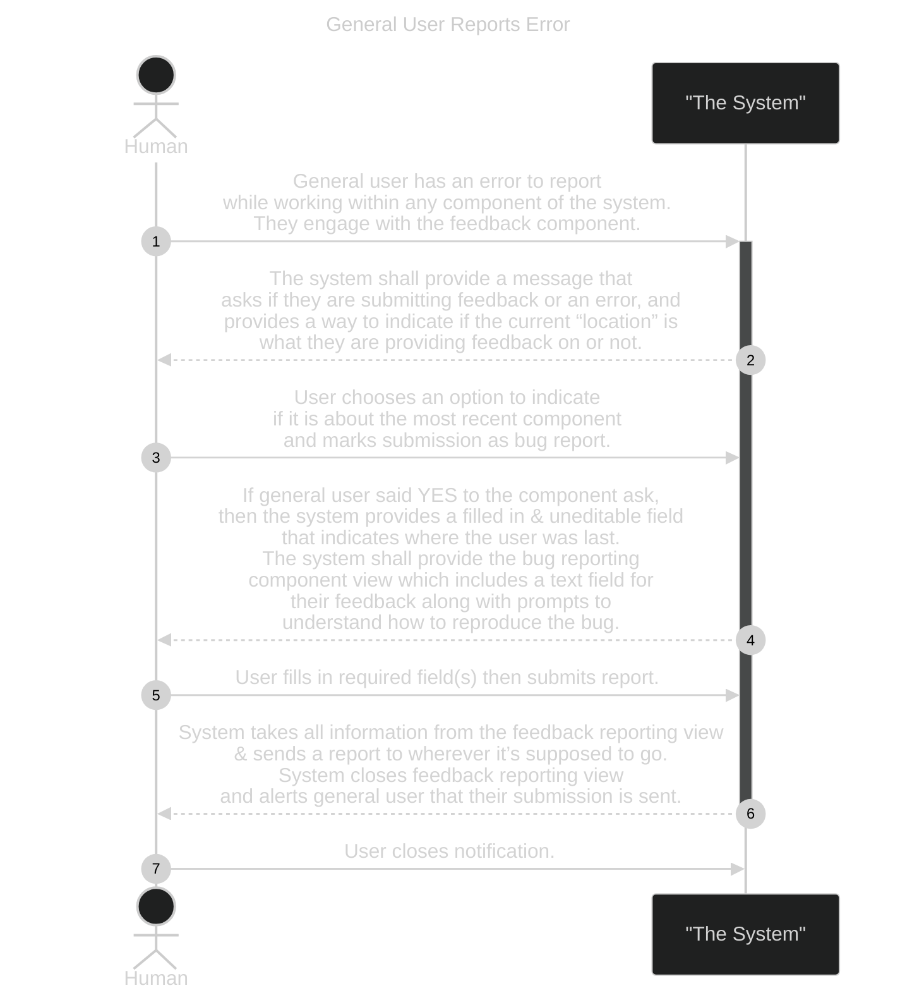
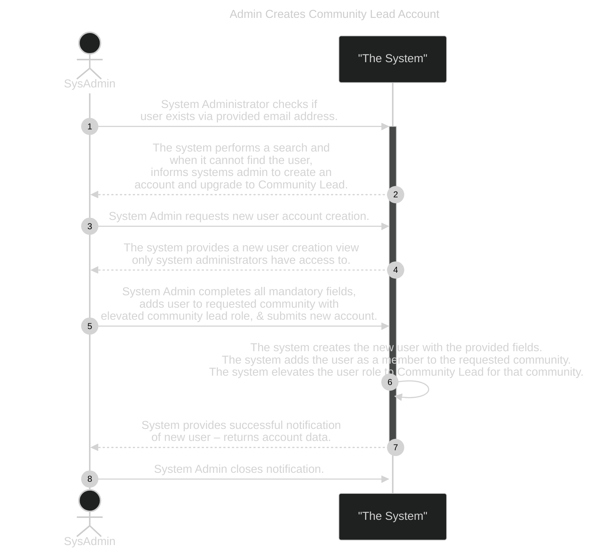
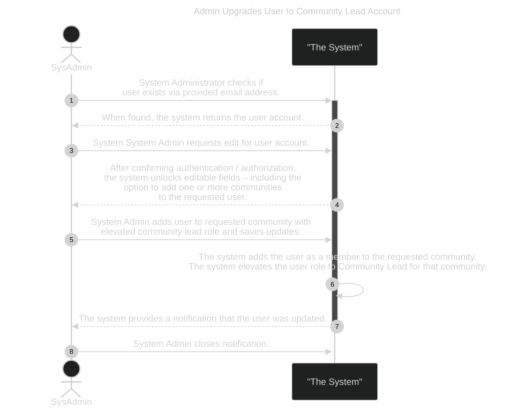

# Use Case Behavior Diagrams

This file is a continuation of the [Use Cases](./REQ-000c_UseCases.md) file. It will provide the behavior diagrams of the different use cases.

This section is not yet complete as of December 2024. This is a working document, as progression is made throughout the solution based on prioritized work.

Excluding the [Guidelines](#ucbd-guidelines) & [Template](#ucbd-template) sections, each section below relates to a specific sub-system as outlined in the [Scope Tree](./REQ-000b_Scope.md#scope-tree):

1.	[General User](#subsystem--general-user-actions)

2.	[Admin Access](#subsystem--admin-elevated-user-access)

3.	[Community Member](#subsystem--community-member)

## Identifying Top High Priority Use Cases

When identifying high use case needs for this course, consider ones that:

- Directly address stakeholder's primary needs

- Have a significant influence on the performance of your system

- Address situations considered to be high risk, including ones that focus on undesired occurrences

- Require your system to perform complex and important tasks

- Occur very frequently

The XLSX for this is here.

| PRIORITY | ACTOR | ACTION | How Critical? (H/M/L) | UC Diagram (miro) | UCBD |
| --- | --- | --- | --- | --- | --- |
| 1 | general system user | Searches for information on a specific plant. | High | [here](https://miro.com/app/board/uXjVLFJo2wg=/?moveToWidget=3458764607290502924&cot=14) | Plant Search |
| 2 | general system user | Provides feedback or reports an error | High | [here](https://miro.com/app/board/uXjVLFJo2wg=/?moveToWidget=3458764607290502924&cot=14) | 1. Gives Feedback 2. Reports Error |
| 3 | System admin | Manages all accounts | High | [here](https://miro.com/app/board/uXjVLFJo2wg=/?moveToWidget=3458764607727412356&cot=14) | 1. Create Community Lead 2. Add Community Lead 3. Make Account Inactive for Specific Community 4. Create general user account 5. Delete account |
| 4 | System admin | Creates city admin accounts | High | [here](https://miro.com/app/board/uXjVLFJo2wg=/?moveToWidget=3458764607727412356&cot=14) | See #3’s #1 |
| 5 | Gardener – Community (member) | Access community announcements. | High | [here](https://miro.com/app/board/uXjVLFJo2wg=/?moveToWidget=3458764607446135000&cot=14) | Access Announcements |
| 6 | Gardener – Community (member) | Includes all **general system user** actions & access is based on a unique community ID | High | [here](https://miro.com/app/board/uXjVLFJo2wg=/?moveToWidget=3458764607446135000&cot=14) | ? |
| 7 | general system user | Cannot access any community-specific training, materials, or special information that only members or specific teams can see UNLESS they are also a member of that community. | High | [here](https://miro.com/app/board/uXjVLFJo2wg=/?moveToWidget=3458764607290502924&cot=14) | ? |
| 8 | City Admin – Community Lead | Assigns teams & chores to their community gardeners. | High | [here](https://miro.com/app/board/uXjVLFJo2wg=/?moveToWidget=3458764607735882431&cot=14) | ? |
| 9 | Gardener – Community (member) | Turn on/off ability to be seen by other community members. (Does not apply to **City admins**.) | High | [here](https://miro.com/app/board/uXjVLFJo2wg=/?moveToWidget=3458764607446135000&cot=14) | ? |
| 10 |  | System provides a way to filter plants based on user selection criteria (e.g.: color, seeding date, etc) | High | [here](https://miro.com/app/board/uXjVLFJo2wg=/?moveToWidget=3458764607290502924&cot=14) | Plant Filtering |

## UCBD Guidelines

1.	Write as shall statements

2.	Write as correct statements (what you’re saying is accurate)

3.	Write clear & precise statements
    - One idea per requirement
    - If “and” or similar conjunction in requirements, considered better to split

4.	Write unambiguous statements (only 1 way to interpret)

5.	Write objective statements (if anything is subjective, qualify with some quantifiable measure)

6.	Write verifiable statements (some measurable way to say requirement is met)

7.	Write consistent statements (does not contradict another requirement)

Some organizations may also include the following as their best practices:

1.	Implementation independent (functional, not structural)

2.	Achievable (feasible)

3.	Conforming (consistent with regulations imposed by stakeholders & any other governing entity)

## UCBD Template

<!-- --8<-- [start:UCBD-Template] -->

_**NOTE:**  Utilize mermaid documentation [here](https://mermaid.js.org/syntax/sequenceDiagram.html) when designing your SysML to work within MarkDown and on GitHub_

**Use Case Name:**  TBD

**Initial Conditions:**

1. TBD

 

**Ending Conditions:**

1. TBD

**Notes:**

1. TBD

**Identifying Missed Functionality:**

| Additional Grouping of Requirements | Description |
| ----------------------------------- | ----------- |
| \* | “Functionality 1” |
| \*\* | “Functionality 2” |
| \*\*\* | “Functionality 3” |

Identifying Missed Functionality – the system shall be able to:

- *item 1 of F1
- **item 1 of F2
- ***item 1 of F3

**SysML Diagram:**

TBD

**Requirements Table:**

_See the [requirement constants definition table](./REQ-000e_Requirements.md) for more. (Including this section!)_

| Component | Function | Single Unique ID | Unique ID | Requirements | Unique Name |
| --- | --- | --- | --- | --- | --- |
| **System.COMPONENT** | FUNCTION | OR.X | ORX.Y | TBD | TBD |

<!-- --8<-- [end:UCBD-Template] -->

## SUBSYSTEM:  General User Actions

The subitems in this section all belong to the GeneralUser system actions set.

Below you will find the use case behavior diagrams for this subsystem.

As of Nov 29, 2024 – this is not complete only parts were needed at the time of creation and part of a Systems Design certification course. As work progresses, this will continue to be updated.

**UCBDs for General User Actions:**

1. [Set GPS Permissions](#set-gps-permissions)

2. [User Checks Location Settings](#user-checks-location-settings)

3. [Plant Search](#plant-search)

4. [Plant Search (Filter)](#plant-search-filter)

### Set GPS Permissions

**Use Case Name:**  System Requests Access to GPS – Get User Approval

**Initial Conditions:**

1. First time running the system as a new user or user tries to use GPS modules within the app (e.g.: checking weather, turning on weather-based gardening notifications) without permissions

**Mermaid Diagram:**

 

**Ending Conditions:**

1. GPS permissions are turned on

2. Unique user’s profile has auto-update USDA zone turned on

3. Unique user’s USDA zone field is filled in and user unable to edit

4. Unique user’s profile settings are set to user’s preference and editable in their profile

**Notes:**

1. Need to create a general system UCBD for when user declines.

2. Need to ensure that use case diagrams & scope trees are updated, as the GPD settings is new.

3. “home” is either their profile or an area user can locate all components they have access to.

**Identifying Missed Functionality:**

| Additional Grouping of Requirements | Description |
| ----------------------------------- | ----------- |
| \* | “System checks for approval” |
| \*\* | “System notifies user” |
| \*\*\* | “System uses GPS data for weather or USDA zone needs” |

Identifying Missed Functionality – the system shall be able to:

- *Check if GPS permissions are approved
- **Notify user when GPS is required and not yet approved
- **If unable to connect to GPS, notify user
- **If unable to connect to GPS and no USDA zone saved, will force user to manually provide USDA zone
- ***(with proper permissions & based on frequency settings) automatically check GPS when attempting to pull current or past weather data
- ***will ensure either GPS or manual USDA zone is utilized

**SysML Diagram:**

TBD

**Requirements Table:**

_See the [requirement constants definition table](./REQ-000e_Requirements.md) for more. (Including this section!)_

| Component | Function | Single Unique ID | Unique ID | Requirements | Unique Name |
| --- | --- | --- | --- | --- | --- |
| **System.COMPONENT** | FUNCTION | OR.X | ORX.Y | TBD | TBD |

### User Checks Location Settings

**Use Case Name:**  User Checks Location Settings

**Initial Conditions:**

1. GPS is on and set to automatic update OR it is off

2. USDA zone is empty or USDA zone needs to be updated.

 

**Ending Conditions:**

1. Unique user’s profile is set to manually update USDA zone

2. USDA zone has been updated and saved

**Notes:**

1. By default, automating USDA zone by GPS location should be turned off.

2. Profile can be accessed from anywhere within the system.

**Identifying Missed Functionality:**

| Additional Grouping of Requirements | Description |
| ----------------------------------- | ----------- |
| \* | TBD |
| \*\* | TBD |
| \*\*\* | TBD |

Identifying Missed Functionality – the system shall be able to:

- *item 1 of F1
- **item 1 of F2
- ***item 1 of F3

**SysML Diagram:**

TBD

**Requirements Table:**

_See the [requirement constants definition table](./REQ-000e_Requirements.md) for more. (Including this section!)_

| Component | Function | Single Unique ID | Unique ID | Requirements | Unique Name |
| --- | --- | --- | --- | --- | --- |
| **System.COMPONENT** | FUNCTION | OR.X | ORX.Y | TBD | TBD |

### Plant Search

**Use Case Name:**  General User searches for plant

**Initial Conditions:**

1. Any user has access to this capability.

2. User accesses the plant search function by choosing the spyglass icon seen from any screen.

 

**Ending Conditions:**

1. The system has provided a paginated list of plants the user can choose from to learn more about.

2. User may select a plant to learn more about it and engage the plant view.

**Notes:**

1. Search is intended for plant name, not description or characteristics.

2. Filtering allows for characteristics to be utilized in the search.

3. When chosen, the plants would open a pop-up that when closed or backed out of would take back to the prior screen.

4. There should eventually be a way for the user to request a new plant to be added to the database from this view only.

5. Plant list is paginated and alphabetized.

6. Plant list / search view has a text field to put in a plant name (including scientific)

7. Plant list comes from a database – see documentation on database requirements.

**Identifying Missed Functionality:**

| Additional Grouping of Requirements | Description |
| ----------------------------------- | ----------- |
| \* | Visual Updates |
| \*\* | TBD |
| \*\*\* | TBD |

Identifying Missed Functionality – the system shall be able to:

- *Provide access to the plant search component from anywhere in the system for any user
- *Provide a view of each plant if user tries to access more information about it
- *Display the plant list view in such a manner that each row of a plan takes up the same % of space & still be readable. 

**SysML Diagram:**

Below is the SysML Diagram with requirements table, which can be seen [here](https://miro.com/app/board/uXjVLFJo2wg=/?moveToWidget=3458764609900151796&cot=14) in Miro and last updated 20241208.

**Requirements Table:**

_See the [requirement constants definition table](./REQ-000e_Requirements.md) for more. (Including this section!)_

| Component | Function | Single Unique ID | Unique ID | Requirements | Unique Name |
| --- | --- | --- | --- | --- | --- |
| **System.GenUser** | Plant Search | OR.1 | OR1.1 | The system shall display the plant list view with **max_visible_plants_num** showing in the same state the user last searched for a plant. | display_plants_all |
| **System.GenUser** | Plant Search | OR.2 | OR1.2 | The system shall filter out all plants that do not at least partially match the search term. | plant_search_by_name |
| **System.GenUser** | Plant Search | OR.3 | OR1.3 | If no plants in the database match search criteria, the system shall provide a clear message about this to the user. | msg_plant_404 |

### Plant Search (Filter)

**Use Case Name:**  General User searches for plant with filters

**Initial Conditions:**

1. Any user has access to this capability.

2. User accesses the plant search function by choosing the spyglass icon seen from any screen.

 

**Ending Conditions:**

1. The system has provided a paginated list of plants the user can choose from to learn more about.

2. User may select a plant to learn more about it and engage the plant view.

**Notes:**

1. Search is intended for plant name, not description or characteristics.

2. Filtering allows for characteristics to be utilized in the search. (e.g.: companion plant, color, size, benefits, season)

3. When chosen, the plants would open a pop-up that when closed or backed out of would take back to the prior screen.

4. There should eventually be a way for the user to request a new plant to be added to the database from this view only.

5. Plant list is paginated and alphabetized.

6. Plant list / search view has a text field to put in a plant name (including scientific)

7. Plant list comes from a database – see documentation on database requirements.

**Identifying Missed Functionality:**

| Additional Grouping of Requirements | Description |
| ----------------------------------- | ----------- |
| \* | Additional specific filtering options |
| \*\* | Group TBD |
| \*\*\* | Group TBD |

Identifying Missed Functionality – the system shall be able to:

- _See items from [plant search](#plant-search)_
- *Filter for plants within suggested frost dates
- *Filter for plants that need to be sown / transplanted / etc within 1 week of current date (may not be relevant except for sown since not planning on tracking everything the gardener does – there are other systems for that)

**SysML Diagram:**

Below is the SysML Diagram with requirements table, which can be seen [here](https://miro.com/app/board/uXjVLFJo2wg=/?moveToWidget=3458764609904604938&cot=14) in Miro and last updated 20241209.

**Requirements Table:**

_See the [requirement constants definition table](./REQ-000e_Requirements.md) for more. (Including this section!)_

| Component | Function | Single Unique ID | Unique ID | Requirements | Unique Name |
| --- | --- | --- | --- | --- | --- |
| **System.GenUser** | OR.4 | OR2.1 | The system shall show all plants that match 1 or more criteria. | filter_any |
| **System.GenUser** | OR.5 | OR2.2 | The system shall only show plants that match all requested criteria. | filter_exact |

### View Plants

**Use Case Name:**  General User looks at specific plant data (View Plants)

**Initial Conditions:**

1. Any user has accessed the plant search component

2. A specific plant has been chosen to view

 

**Ending Conditions:**

1. User can easily find information on the plant without having to scroll a lot.

2. User can close the view and to see the system’s component they were at previously.

**Notes:**

1. This view might be used in other locations, such as the plot component to see what’s growing.

**Identifying Missed Functionality:**

| Additional Grouping of Requirements | Description |
| ----------------------------------- | ----------- |
| \* | “Functionality 1” |
| \*\* | “Functionality 2” |
| \*\*\* | “Functionality 3” |

Identifying Missed Functionality – the system shall be able to:

- *item 1 of F1
- **item 1 of F2
- ***item 1 of F3

**SysML Diagram:**

TBD

**Requirements Table:**

_See the [requirement constants definition table](./REQ-000e_Requirements.md) for more. (Including this section!)_

| Component | Function | Single Unique ID | Unique ID | Requirements | Unique Name |
| --- | --- | --- | --- | --- | --- |
| **System.COMPONENT** | FUNCTION | OR.X | ORX.Y | TBD | TBD |

### Give Feedback

This is the same as it was first planned back in Jan 2025. Likely needs review before final implementation.

**Use Case Name:**  General User Submits Improvement Idea / Gives Feedback

**Initial Conditions:**

1. General user has an idea on how to improve something
2. feedback submission is always available

 

**Ending Conditions:**

1. Feedback submission sent to wherever it is supposed to go – initially an email
2. User is notified of their submission & brought back to their most recent component

**Notes:**

1. When the system is integrated with GitHub to automate creation of tickets from bug reports & feedback (to be further through through), the link to the Github issue will be included in the unique user’s profile.

**Identifying Missed Functionality:**

| Additional Grouping of Requirements | Description |
| ----------------------------------- | ----------- |
| \* | “Functionality 1” |
| \*\* | “Functionality 2” |
| \*\*\* | “Functionality 3” |

Identifying Missed Functionality – the system shall be able to:

- *item 1 of F1
- **item 1 of F2
- ***item 1 of F3

**SysML Diagram:**

TBD

**Requirements Table:**

_See the [requirement constants definition table](./REQ-000e_Requirements.md) for more. (Including this section!)_

| Component | Function | Single Unique ID | Unique ID | Requirements | Unique Name |
| --- | --- | --- | --- | --- | --- |
| **System.COMPONENT** | FUNCTION | OR.X | ORX.Y | TBD | TBD |

### Report Error

This is the same as it was first planned back in Jan 2025. Likely needs review before final implementation.

**NOTE:**  this is VERY similar to the other - could potentially consolidate into a single mermaid, but it would go against what was taught in the course. Need to consider what is best for development.

**Use Case Name:**  General User Reports Issue

**Initial Conditions:**

1. General user has run into an issue with the system
2. feedback submission is always available

 

**Ending Conditions:**

1. Bug report sent to wherever it is supposed to go – initially an email
2. User is notified of their submission & brought back to their most recent component

**Notes:**

1. When the system is integrated with GitHub to automate creation of tickets from bug reports & feedback (to be further through through), the link to the Github issue will be included in the unique user’s profile.

**Identifying Missed Functionality:**

| Additional Grouping of Requirements | Description |
| ----------------------------------- | ----------- |
| \* | “Functionality 1” |
| \*\* | “Functionality 2” |
| \*\*\* | “Functionality 3” |

Identifying Missed Functionality – the system shall be able to:

- *item 1 of F1
- **item 1 of F2
- ***item 1 of F3

**SysML Diagram:**

TBD

**Requirements Table:**

_See the [requirement constants definition table](./REQ-000e_Requirements.md) for more. (Including this section!)_

| Component | Function | Single Unique ID | Unique ID | Requirements | Unique Name |
| --- | --- | --- | --- | --- | --- |
| **System.COMPONENT** | FUNCTION | OR.X | ORX.Y | TBD | TBD |

## SUBSYSTEM:  Admin (Elevated User) Access

This is the same as it was first planned back in Jan 2025. Likely needs review before final implementation.

**NOTE:** Additional deliverables not yet planned, but should leverage the [UCBD Template](#ucbd-template):

- Make Account Inactive For Specific Community
- Create Account
- Delete Account

### Create Community Lead

This is the same as it was first planned back in Jan 2025. Likely needs review before final implementation.

**Use Case Name:**  Admin Creates Community Lead Account

**Initial Conditions:**

1. Need to upgrade account to community lead after confirming with community leadership to provide this level of access to the requesting individual
2. Community already exists in the system
3. Potential community lead is not in the system

 

**Ending Conditions:**

1. New user created tied to a specific community
2. New user has elevated permissions only within that assigned community

**Notes:**

1. Need UCBD for when the community is not in the system
2. Users can join more than 1 community, but can only access data related to communities they have joined and been approved by the community lead

**Identifying Missed Functionality:**

| Additional Grouping of Requirements | Description |
| ----------------------------------- | ----------- |
| \* | “Functionality 1” |
| \*\* | “Functionality 2” |
| \*\*\* | “Functionality 3” |

Identifying Missed Functionality – the system shall be able to:

- *item 1 of F1
- **item 1 of F2
- ***item 1 of F3

**SysML Diagram:**

TBD

**Requirements Table:**

_See the [requirement constants definition table](./REQ-000e_Requirements.md) for more. (Including this section!)_

| Component | Function | Single Unique ID | Unique ID | Requirements | Unique Name |
| --- | --- | --- | --- | --- | --- |
| **System.COMPONENT** | FUNCTION | OR.X | ORX.Y | TBD | TBD |

### Upgrade User to Community Lead

This is the same as it was first planned back in Jan 2025. Likely needs review before final implementation - especially since this is part of [creating a community lead](#create-community-lead).

**Use Case Name:**  Admin Upgrades User to Community Lead Account

**Initial Conditions:**

1. Need to upgrade account to community lead after confirming with community leadership to provide this level of access to the requesting individual

 

**Ending Conditions:**

1. If user is not already in a community, their account is updated
2. User is given elevated privileges only within that assigned community

**Notes:**

1. Need UCBD for when the community is not in the system
2. Users can join more than 1 community, but can only access data related to communities they have joined and been approved by the community lead

**Identifying Missed Functionality:**

| Additional Grouping of Requirements | Description |
| ----------------------------------- | ----------- |
| \* | “Functionality 1” |
| \*\* | “Functionality 2” |
| \*\*\* | “Functionality 3” |

Identifying Missed Functionality – the system shall be able to:

- *item 1 of F1
- **item 1 of F2
- ***item 1 of F3

**SysML Diagram:**

TBD

**Requirements Table:**

_See the [requirement constants definition table](./REQ-000e_Requirements.md) for more. (Including this section!)_

| Component | Function | Single Unique ID | Unique ID | Requirements | Unique Name |
| --- | --- | --- | --- | --- | --- |
| **System.COMPONENT** | FUNCTION | OR.X | ORX.Y | TBD | TBD |

### TODO: Make Account Inactive for Specific Community

This is the same as it was first planned back in Jan 2025. Likely needs review before final implementation.

**Use Case Name:**  TBD

**Initial Conditions:**

1. TBD

 

**Ending Conditions:**

1. TBD

**Notes:**

1. TBD

**Identifying Missed Functionality:**

| Additional Grouping of Requirements | Description |
| ----------------------------------- | ----------- |
| \* | “Functionality 1” |
| \*\* | “Functionality 2” |
| \*\*\* | “Functionality 3” |

Identifying Missed Functionality – the system shall be able to:

- *item 1 of F1
- **item 1 of F2
- ***item 1 of F3

**SysML Diagram:**

TBD

**Requirements Table:**

_See the [requirement constants definition table](./REQ-000e_Requirements.md) for more. (Including this section!)_

| Component | Function | Single Unique ID | Unique ID | Requirements | Unique Name |
| --- | --- | --- | --- | --- | --- |
| **System.COMPONENT** | FUNCTION | OR.X | ORX.Y | TBD | TBD |

### TODO: Create Account

This is the same as it was first planned back in Jan 2025. Likely needs review before final implementation.

**Use Case Name:**  TBD

**Initial Conditions:**

1. TBD

 

**Ending Conditions:**

1. TBD

**Notes:**

1. TBD

**Identifying Missed Functionality:**

| Additional Grouping of Requirements | Description |
| ----------------------------------- | ----------- |
| \* | “Functionality 1” |
| \*\* | “Functionality 2” |
| \*\*\* | “Functionality 3” |

Identifying Missed Functionality – the system shall be able to:

- *item 1 of F1
- **item 1 of F2
- ***item 1 of F3

**SysML Diagram:**

TBD

**Requirements Table:**

_See the [requirement constants definition table](./REQ-000e_Requirements.md) for more. (Including this section!)_

| Component | Function | Single Unique ID | Unique ID | Requirements | Unique Name |
| --- | --- | --- | --- | --- | --- |
| **System.COMPONENT** | FUNCTION | OR.X | ORX.Y | TBD | TBD |

### TODO: Delete Account

This is the same as it was first planned back in Jan 2025. Likely needs review before final implementation.

**Use Case Name:**  TBD

**Initial Conditions:**

1. TBD

 

**Ending Conditions:**

1. TBD

**Notes:**

1. TBD

**Identifying Missed Functionality:**

| Additional Grouping of Requirements | Description |
| ----------------------------------- | ----------- |
| \* | “Functionality 1” |
| \*\* | “Functionality 2” |
| \*\*\* | “Functionality 3” |

Identifying Missed Functionality – the system shall be able to:

- *item 1 of F1
- **item 1 of F2
- ***item 1 of F3

**SysML Diagram:**

TBD

**Requirements Table:**

_See the [requirement constants definition table](./REQ-000e_Requirements.md) for more. (Including this section!)_

| Component | Function | Single Unique ID | Unique ID | Requirements | Unique Name |
| --- | --- | --- | --- | --- | --- |
| **System.COMPONENT** | FUNCTION | OR.X | ORX.Y | TBD | TBD |

## SUBSYSTEM:  Community Member

This is not fully fleshed out at the moment, as there are some elevated user access to be considered.

### TODO: General Member - Access Announcements

**Use Case Name:**  TBD

**Initial Conditions:**

1. TBD

 

**Ending Conditions:**

1. TBD

**Notes:**

1. TBD

**Identifying Missed Functionality:**

| Additional Grouping of Requirements | Description |
| ----------------------------------- | ----------- |
| \* | “Functionality 1” |
| \*\* | “Functionality 2” |
| \*\*\* | “Functionality 3” |

Identifying Missed Functionality – the system shall be able to:

- *item 1 of F1
- **item 1 of F2
- ***item 1 of F3

**SysML Diagram:**

TBD

**Requirements Table:**

_See the [requirement constants definition table](./REQ-000e_Requirements.md) for more. (Including this section!)_

| Component | Function | Single Unique ID | Unique ID | Requirements | Unique Name |
| --- | --- | --- | --- | --- | --- |
| **System.COMPONENT** | FUNCTION | OR.X | ORX.Y | TBD | TBD |
