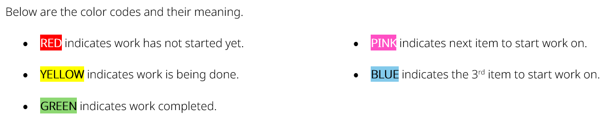
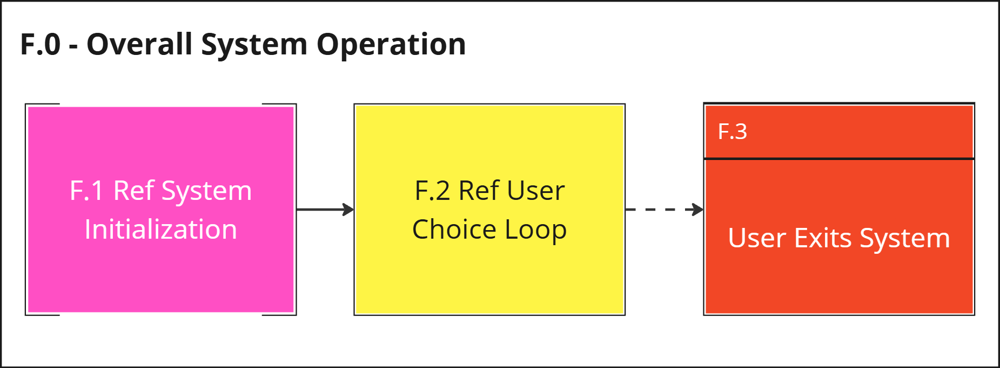
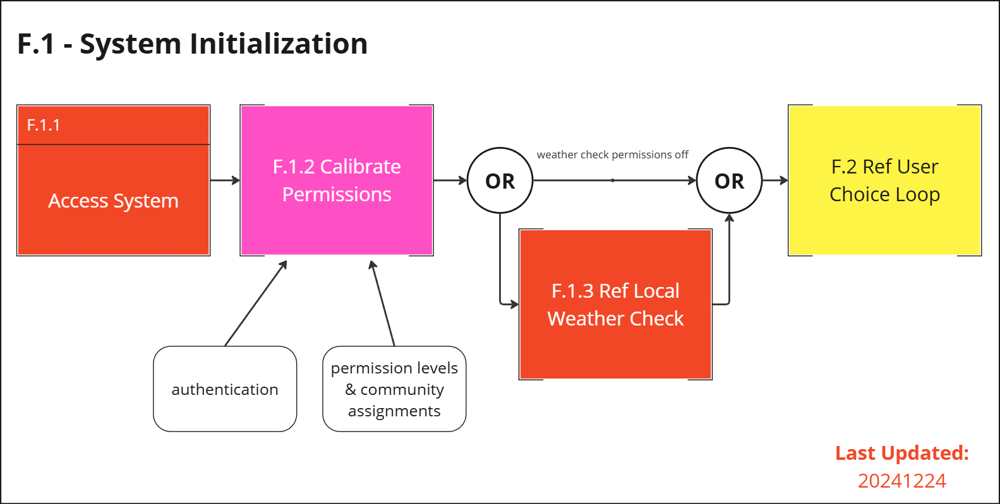
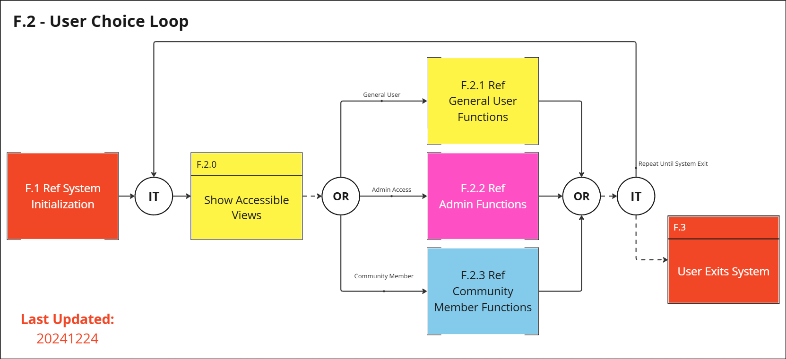
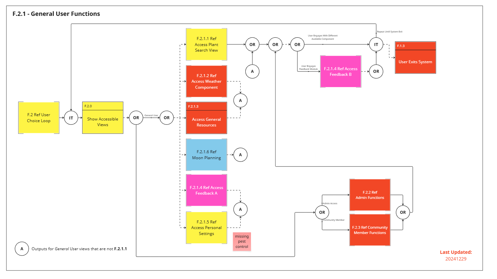
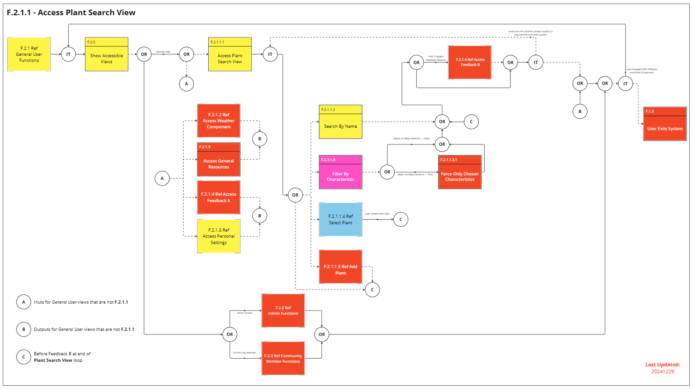
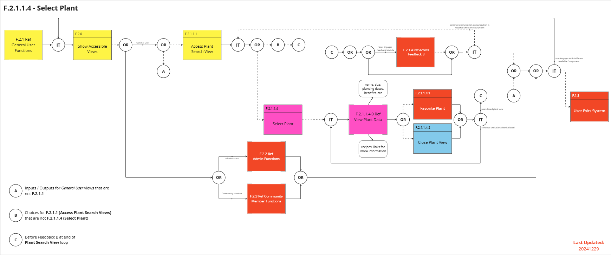
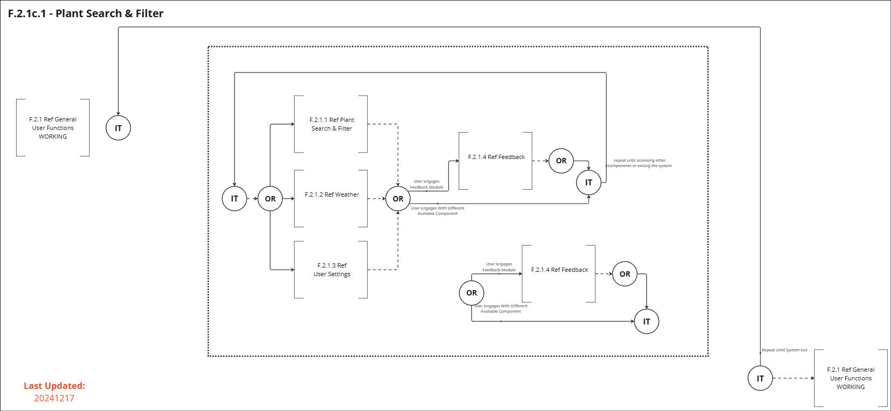
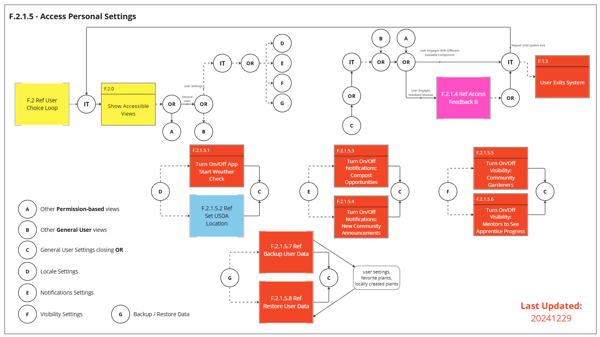

# Functional Flow Block Diagrams

As of 20251226, I have not yet found a tool to take what I did in Miro and put into machine readable text.

Below you will find the FFBDs of the modules currently outlined in the following:

1. [Use Cases](./REQ-000c_UseCases.md)
2. [Use Case Behavior Diagrams](./REQ-000d_UCBDs.md)
3. [Requirements](./REQ-000e_Requirements.md)

This file is mostly here to provide snippets with which to share the sections in the prior documentation.

## Legend

Below is the legend for the FFBDs:

## Table of Contents

- [Informal Interfaces & Uncertainties](#informal-interfaces--uncertainties)
- [F.0 - Overall System Operations](#f0---overall-system-operations)
- [F.1 - System Initiation](#f1---system-initiation)
    - [F.1.2 - Calibrate Permissions](#f12---calibrate-permissions)
    - [F.1.3 - Local Weather Check](#f13---local-weather-check)
- [F.2 - User Choice Loop](#f2---user-choice-loop)
    - [F.2.1 - General User Functions](#f21---general-user-functions)
        - [F.2.1.1 - Access Plant Search View](#f211---access-plant-search-view)
            - [F.2.1.1.4 - Select & View Plant](#f2114---select--view-plant)
        - [F.2.1c.1 - Plant Search & Filter View](#f21c1---plant-search--filter-view)
        - [F.2.1.5 – Access Personal Settings](#f215--access-personal-settings)
- Not Yet Planned:
    - [F.2.1.1.4.0 - View Plant Data](#f21140---view-plant-data)
    - [F.2.1.1.5 - Add Plant](#f2115---add-plant)
    - [F.2.1.2 – Access Weather Component](#f212--access-weather-component)
    - [F.2.1.3 – Access General Resources](#f213--access-general-resources)
    - [F.2.1.4 – Feedback A & B](#f214--feedback-a--b)
    - [F.2.1.5.2 – Set USDA Location](#f2152--set-usda-location)
    - [F.2.1.5.7 – Backup User Data](#f2157--backup-user-data)
    - [F.2.1.5.8 – Restore User Data](#f2158--restore-user-data)
    - [F.2.1.6 – Moon Planning](#f216--moon-planning)
    - [F.2.2 – Admin Functions](#f22--admin-functions)
    - [F.2.3 – Community Member Functions](#f23--community-member-functions)

## Informal Interfaces & Uncertainties

Below is the informal list of interfaces & uncertainties for part 1 of this project:

- Somehow the end user interacts with something to get to the 3 main views (general user, admin functions, community member functions) and then to the plant search / filter component within the General User section

- The system must interface with some internal database to view, search for, and even add plants

- **F.2.1.4** is an interface into a sub-system with which to provide feedback or bug reports

- Uncertain as to how the system should interact when the feedback function should be available everywhere and provide different engagement with the end user depending on how it was engaged

### Functional Block Interfaces (Informal)

Below is an informal list of functional block interfaces:

- Same as from [above](#informal-interfaces--uncertainties)

- Settings interface needed for user to update preferences regarding visibility to others, location settings, & notifications

- Administration interface needed for those with elevated permissions

- Authentication options (e.g.:  Google email) so users can save plants, backup/restore settings, etc

## F.0 - Overall System Operations

The below image comes from [this](https://miro.com/app/board/uXjVLFJo2wg=/?moveToWidget=3458764610830222026&cot=14) Miro frame.

This can be called elsewhere with the following code:

`--8<-- "requirements/REQ-000f_FBDs.md:f0---overall-system-operations"`

## F.1 - System Initiation

The below image comes from [this](https://miro.com/app/board/uXjVLFJo2wg=/?moveToWidget=3458764610994814935&cot=14) Miro frame.

This can be called elsewhere with the following code:

`--8<-- "requirements/REQ-000f_FFBDs.md:f1---system-initiation"`

### F.1.2 - Calibrate Permissions

This has not yet been planned out as of summer 2025.

This can be called elsewhere with the following code:

`--8<-- "requirements/REQ-000f_FFBDs.md:f12---calibrate-permissions"`

### F.1.3 - Local Weather Check

This has not yet been planned out as of summer 2025.

This can be called elsewhere with the following code:

`--8<-- "requirements/REQ-000f_FFBDs.md:f13---local-weather-check"`

## F.2 - User Choice Loop

This can be found in [this](https://miro.com/app/board/uXjVLFJo2wg=/?moveToWidget=3458764611060463634&cot=14) Miro frame.

This can be called elsewhere with the following code:

`--8<-- "requirements/REQ-000f_FFBDs.md:f2---user-choice-loo"`

### F.2.1 - General User Functions

The below image comes from [this](https://miro.com/app/board/uXjVLFJo2wg=/?moveToWidget=3458764610914895271&cot=14) Miro frame.

This can be called elsewhere with the following code:

`--8<-- "requirements/REQ-000f_FFBDs.md:f21---general-user-functions"`

#### F.2.1.1 - Access Plant Search View

The below image comes from [this](https://miro.com/app/board/uXjVLFJo2wg=/?moveToWidget=3458764611162560707&cot=14) Miro frame.

This can be called elsewhere with the following code:

`--8<-- "requirements/REQ-000f_FFBDs.md:#f211---access-plant-search-view"`

##### F.2.1.1.4 - Select & View Plant

The below image comes from [this](https://miro.com/app/board/uXjVLFJo2wg=/?moveToWidget=3458764611871207291&cot=14) Miro frame.

This can be called elsewhere with the following code:

`--8<-- "requirements/REQ-000f_FFBDs.md:f2114---select--view-plant"`

###### F.2.1.1.4.0 - View Plant Data

This has not yet been planned out as of summer 2025.

Since this might be able to go under the one above it, will not link in ToC yet.

##### F.2.1.1.5 - Add Plant

This has not yet been planned out as of summer 2025.

Thus not linked in ToC either.

#### F.2.1c.1 - Plant Search & Filter View

The below image comes from this Miro frame.

This can be called elsewhere with the following code:

`--8<-- "requirements/REQ-000f_FFBDs.md:f21c1---plant-search--filter-view"`

#### F.2.1.2 – Access Weather Component

This has not yet been planned out as of summer 2025.

Thus not linked in ToC either.

#### F.2.1.3 – Access General Resources

This has not yet been planned out as of summer 2025.

Thus not linked in ToC either.

#### F.2.1.4 – Feedback A & B

This has not yet been planned out as of summer 2025.

Thus not linked in ToC either.

#### F.2.1.5 – Access Personal Settings

The below image comes from [this](https://miro.com/app/board/uXjVLFJo2wg=/?moveToWidget=3458764611315618628&cot=14) Miro frame.

This can be called elsewhere with the following code:

`--8<-- "requirements/REQ-000f_FFBDs.md:f215--access-personal-settings"`

##### F.2.1.5.2 – Set USDA Location

This has not yet been planned out as of summer 2025.

Thus not linked in ToC either.

##### F.2.1.5.7 – Backup User Data

This has not yet been planned out as of summer 2025.

Thus not linked in ToC either.

##### F.2.1.5.8 – Restore User Data

This has not yet been planned out as of summer 2025.

Thus not linked in ToC either.

#### F.2.1.6 – Moon Planning

This has not yet been planned out as of summer 2025.

Thus not linked in ToC either.

This component will take information known about gardening with the moon based on when the first day of the new moon is. Based on these calculations, the system shall provide guidance on what to do today and in the next week.

### F.2.2 – Admin Functions

This has not yet been planned out as of summer 2025.

Thus not linked in ToC either.

### F.2.3 – Community Member Functions

This has not yet been planned out as of summer 2025.

Thus not linked in ToC either.

