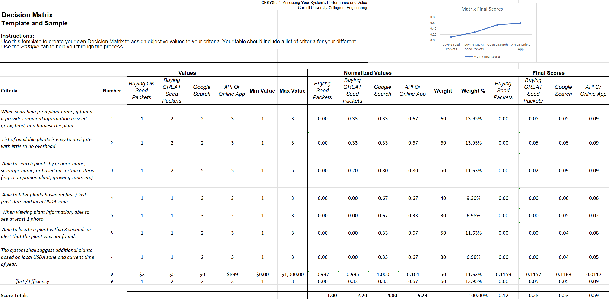
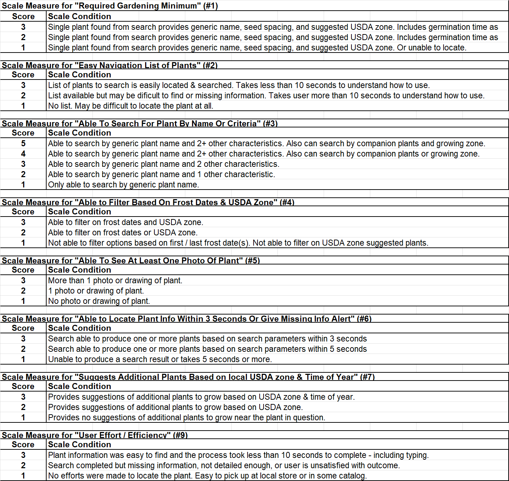
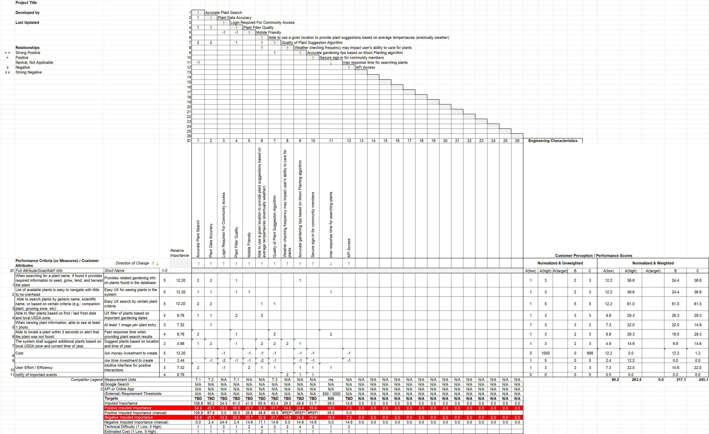
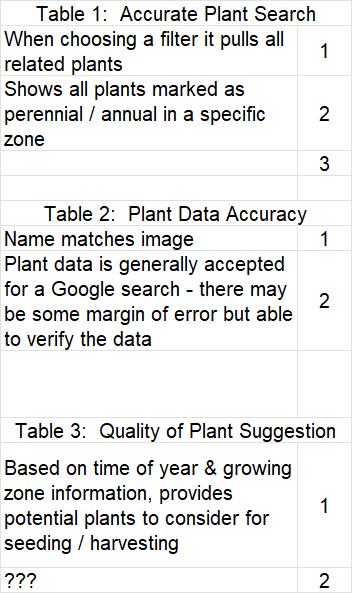
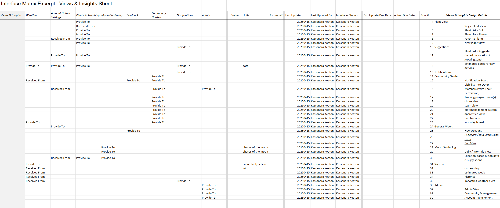
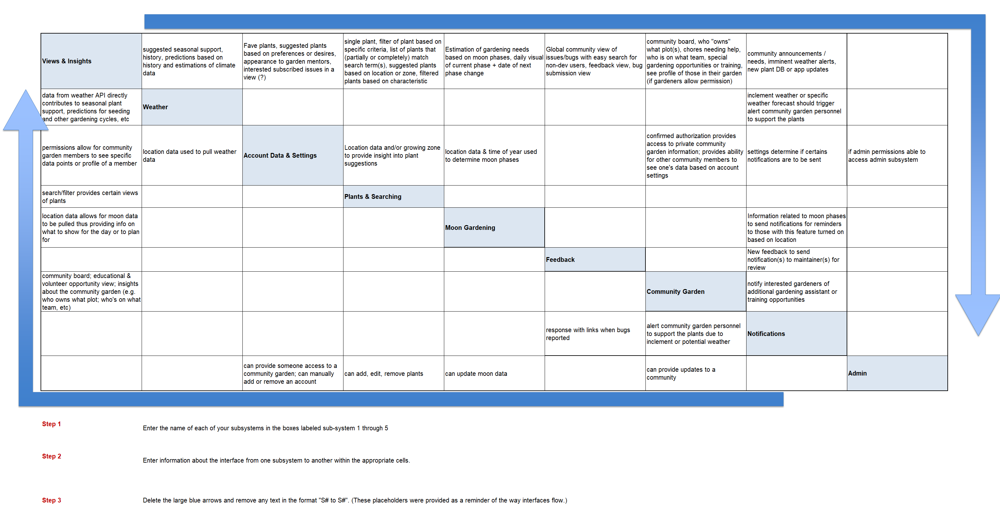
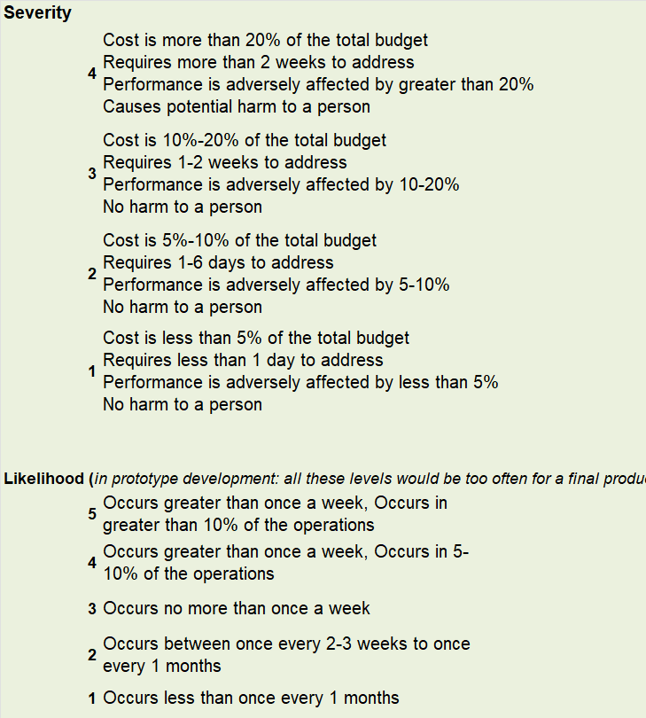
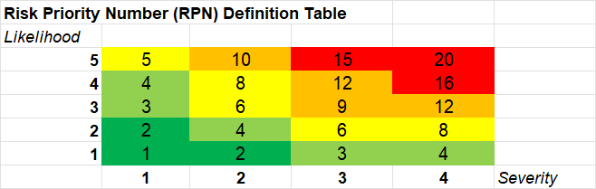
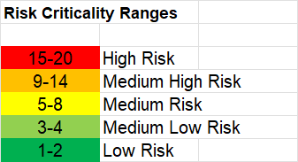
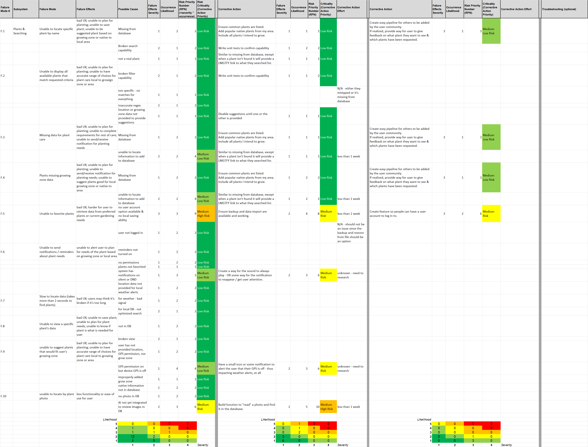

# Design Decisions and Analysis

This document tracks the formal decision-making processes, trade-off analyses, and system design decisions for the Gardening Application.

---

## Context

### Purpose

This requirements document captures the formal decision-making artifacts created during the systems design process as part of Cornell's Systems Design certification program. These artifacts document how critical architectural and design decisions were made using structured engineering methodologies.

### Role in Application

Design decisions form the foundation for the system architecture and implementation approach. They ensure that:

- Design choices are data-driven and documented
- Trade-offs between competing approaches are formally analyzed
- Stakeholder needs are systematically prioritized
- System interfaces and interactions are clearly defined
- Failure modes are identified and mitigated early

### Users

- **Primary Users:** System architects, developers, and technical decision-makers
- **Secondary Users:** Project stakeholders who need to understand design rationale
- **Stakeholders:** Future maintainers who need to understand why decisions were made

---

## Decision Artifacts

This section references the formal decision analysis documents stored in `docs/decisions/`. These files are created using systems engineering methodologies and provide structured analysis frameworks.

### Decision Matrix (CESYS524)

**File:** `docs/decisions/CESYS524_decision-matrix.xlsx`

**Purpose:** Multi-criteria decision analysis comparing different architectural approaches or technology choices.

A decision matrix evaluates alternatives against weighted criteria to select the optimal solution objectively.

**Key Applications:**

- Framework selection (Django vs Flask vs FastAPI)
- Database technology choices (PostgreSQL vs SQLite vs MongoDB)
- Frontend architecture decisions (HTMX vs React vs Vue)
- Deployment platform selection (Docker vs Kubernetes vs bare metal)

Below is an image of the file:



And here is an image of the scoring matrix:



<!-- **Example Usage in Documentation:**

IF trying to render data, you would run the following in mkdocs:

```markdown
## Technology Selection Decision

The following decision matrix was used to evaluate framework options:

\{\{ read_excel('../decisions/CESYS524_decision-matrix.xlsx') \}\}
```

{{ read_excel('../decisions/CESYS524_decision-matrix.xlsx') }} -->

---

### Quality Function Deployment Matrix (CESYS525)

**File:** `docs/decisions/CESYS525_QFD-XLS.xls`

**Purpose:** Maps customer requirements (the "voice of the customer") to technical specifications and design features.

QFD ensures the system design directly addresses user needs with appropriate technical solutions.

**Key Applications:**

- Mapping stakeholder needs to system features
- Prioritizing development efforts based on user value
- Ensuring technical specifications support user goals
- Identifying relationships between requirements

Below is an image of the file:



And here is an image of the scoring table:



<!-- **Example Usage in Documentation:**

```markdown
## Requirements to Design Mapping

This QFD matrix maps user needs to technical requirements:

{{ read_excel('../decisions/CESYS525_QFD-XLS.xls') }}
``` -->

---

### Interface Matrix (CESYS526)

**File:** `docs/decisions/CESYS526-Interface-Matrix.xlsx`

**Purpose:** Documents interactions and data exchanges between system components.

The interface matrix identifies all communication paths, data flows, and dependencies between modules.

**Key Applications:**

- API design and contract definition
- Component coupling analysis
- Integration testing planning
- Microservice boundary identification

Below is an image of the file:



<!-- **Example Usage in Documentation:**

```markdown
## System Interface Definition

The interface matrix defines all component interactions:

{{ read_excel('../decisions/CESYS526-Interface-Matrix.xlsx') }}
``` -->

---

### N-Squared Chart (CESYS526)

**File:** `docs/decisions/CESYS526_n-squared-chart.xlsx`

**Purpose:** Visual matrix showing bidirectional interactions between all system elements.

The N-squared chart (N²) provides a comprehensive view of system connectivity and helps identify interface complexity.

**Key Applications:**

- Identifying tightly coupled components
- Planning integration sequence
- Understanding system complexity
- Architectural refactoring decisions

Below is an image of the file:



<!-- **Example Usage in Documentation:**

```markdown
## System Interaction Overview

This N-squared chart shows all component interactions:

{{ read_excel('../decisions/CESYS526_n-squared-chart.xlsx') }}
``` -->

---

### Failure Mode and Effects Analysis (CESYS527)

**File:** `docs/decisions/CESYS527_FMEA.xlsx`

**Purpose:** Systematic analysis of potential failure modes, their impacts, and mitigation strategies.

FMEA identifies what can go wrong, how likely it is, how severe the impact would be, and what can be done to prevent or mitigate failures.

**Key Applications:**

- Security vulnerability identification
- Reliability engineering
- Error handling design
- Backup and recovery planning
- Quality assurance planning

**FMEA Scoring:**

- **Severity (S):** Impact of failure (1-10, 10 = catastrophic)
- **Occurrence (O):** Likelihood of failure (1-10, 10 = very likely)
- **Detection (D):** Ability to detect before impact (1-10, 10 = undetectable)
- **Risk Priority Number (RPN):** S × O × D (prioritizes mitigation efforts)

Severity & Likelihood are outlined as follows:



You can see how the risk priority number (RPN) is calculated below:



Risk ranges are outlined as follows:



A screenshot of the example found in ? is here:



<!-- **Example Usage in Documentation:**

```markdown
## Risk Analysis and Mitigation

FMEA analysis of system failure modes:

{{ read_excel('../decisions/CESYS527_FMEA.xlsx') }}
``` -->

---

## Using Decision Artifacts in Development

### During Requirements Phase

**Decision Matrix:**

- Choose between competing feature approaches
- Select technology stack components
- Prioritize requirements implementation order

**QFD Matrix:**

- Validate requirements address user needs
- Identify gaps in stakeholder coverage
- Ensure technical specs support user stories

### During Design Phase

**Interface Matrix & N-Squared Chart:**

- Define API contracts between components
- Identify architectural boundaries
- Plan integration testing strategy
- Detect circular dependencies

**FMEA:**

- Design error handling strategies
- Plan fault tolerance mechanisms
- Identify security controls needed
- Design monitoring and alerting

### During Implementation Phase

**All Artifacts:**

- Reference decisions when questions arise
- Validate implementation matches design rationale
- Update artifacts if requirements change
- Document deviations and their justification

---

## Best Practices

### Creating Decision Artifacts

1. **Be Specific:** Use quantitative criteria whenever possible
2. **Document Assumptions:** Note what constraints or assumptions influenced the decision
3. **Include Stakeholders:** Ensure relevant parties contribute to criteria weighting
4. **Version Control:** Track changes to decisions over time
5. **Link to Requirements:** Connect decisions to specific requirements they support

<!-- ### Using Table Reader Plugin

**Advantages:**

- Source data stays in familiar Excel/CSV format
- Changes to spreadsheets automatically update documentation
- No manual copy-paste errors
- Engineers can use spreadsheet tools they know

**Best Practices:**

```markdown
<!-- ✅ Good: Provide context before showing table --
## Framework Selection

We evaluated three Python web frameworks against our requirements:

\{\{ read_excel('../decisions/CESYS524_decision-matrix.xlsx') \}\}

The weighted scores show Django is the optimal choice for our needs.

<!-- ❌ Bad: Table without context --
\{\{ read_excel('../decisions/CESYS524_decision-matrix.xlsx') \}\}
``` -->

### Maintaining Decision Records

- **Update When:** Requirements change, new information emerges, or implementation reveals issues
- **Document Why:** Always explain what prompted the decision review
- **Track History:** Keep old versions to understand evolution of thinking
- **Cross-Reference:** Link to related requirements, specifications, and architecture docs

---

## Integration with Development Workflow

### Requirements → Specifications

When generating specifications from requirements using `/make-spec-from-req`:

1. Reference relevant decision matrices to understand chosen approaches
2. Consult QFD to ensure specs address user needs
3. Check interface matrices for integration requirements
4. Review FMEA for error handling and security requirements

### Specifications → Code

When implementing with `/implement-spec`:

1. Use interface definitions from matrices for API design
2. Implement mitigations identified in FMEA
3. Validate implementation against decision criteria
4. Document any deviations from decided approach

---

## Related Documentation

- **Architecture Diagrams:** `docs/diagrams/`
- **Requirements Documents:** `docs/requirements/`
- **Specifications:** `docs/specifications/`
- **Threat Models:** Generated during spec process
- **MkDocs Extensions Guide:** `docs/tutorials/mkdocs/mkdocs-extensions-guide.md` (for table-reader-plugin syntax)

---

## Success Criteria

### Decision Quality

- [ ] Decisions use structured methodologies (decision matrix, QFD, FMEA)
- [ ] Criteria are clearly defined and appropriately weighted
- [ ] Stakeholder input is documented
- [ ] Assumptions and constraints are explicit
- [ ] Rationale is traceable to requirements

### Documentation Quality

- [ ] Decision artifacts are version controlled
- [ ] Tables render correctly in MkDocs
- [ ] Context is provided for each decision
- [ ] Cross-references to requirements are present
- [ ] Update process is documented

### Traceability

- [ ] Can trace from user need → QFD → requirement → decision → spec → code
- [ ] FMEA findings link to security requirements
- [ ] Interface definitions link to integration tests
- [ ] Decision criteria link to success metrics

---

## Notes & Considerations

### Open Questions

- Should we create decision records for smaller tactical decisions, or only strategic ones?
- What's the right level of detail for documenting decision criteria?
- How do we ensure decisions are revisited when assumptions change?

### Future Enhancements

- Create decision record templates for common decision types
- Automate decision artifact generation from requirements
- Build dashboard showing decision impact on architecture
- Link FMEA findings to CodeGuard security rules

### Tools & Techniques

**Systems Engineering Methods:**

- Decision Matrix Analysis (multi-criteria decision making)
- Quality Function Deployment (House of Quality)
- N-Squared Charts (interface analysis)
- Failure Mode and Effects Analysis (risk analysis)

**Documentation Tools:**

- Excel/CSV for structured data
- MkDocs table-reader-plugin for rendering
- Git for version control
- Miro for visual collaboration

---

**Maintained By:** Gardening App Development Team
