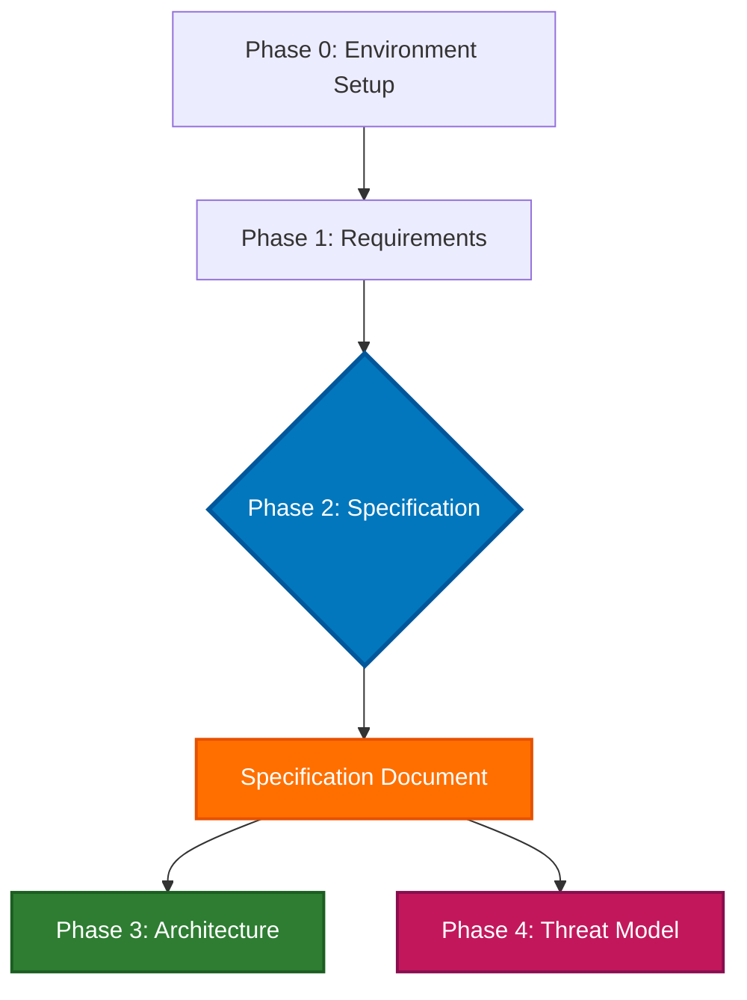

# Mermaid Diagram Dark Mode Styling

!!! warning
    This has been written by AI & not yet reviewed nor confirmed by a human. I am still working on this at this time, so mermaid diagrams may look odd on the dark mode.

## Problem

When using Mermaid diagrams in MkDocs with Material theme, text readability can be poor in dark mode when using custom background colors. Light pastel backgrounds that look great in light mode can make white text (dark mode's default) difficult to read.

## Solutions Overview

There are two main approaches to ensure Mermaid diagrams are readable in both light and dark modes:

1. **CSS-based theme adaptation** - Override text colors based on the active theme
2. **Color scheme selection** - Use darker backgrounds that work well in both modes

---

## Option 1: CSS Theme Adaptation (Recommended)

**Pros:**
- ✅ Keep your beautiful pastel colors
- ✅ Automatic theme switching
- ✅ Centralized styling
- ✅ Easy to maintain

**Cons:**
- ❌ Requires custom CSS file
- ❌ Uses `!important` to override Mermaid's defaults

### Implementation

**Step 1: Add CSS to `docs/stylesheets/extra.css`**

```css
/* ========================================
   Mermaid Diagram Theme Adaptation
   ======================================== */

/* Light mode - ensure dark text is readable on light backgrounds */
[data-md-color-scheme="default"] .mermaid text {
  fill: #000 !important;
}

/* Dark mode - ensure light text is readable on dark backgrounds */
[data-md-color-scheme="slate"] .mermaid text {
  fill: #fff !important;
}
```

**Step 2: Ensure CSS is loaded in `mkdocs.yml`**

```yaml
extra_css:
  - stylesheets/extra.css
```

**Step 3: Test both themes**

```bash
mkdocs serve
```

Toggle between light and dark mode in your browser to verify text is readable in both.

### How It Works

Material for MkDocs uses the `data-md-color-scheme` attribute on the HTML element to indicate the active theme:

- `data-md-color-scheme="default"` → Light mode
- `data-md-color-scheme="slate"` → Dark mode

CSS selectors target `.mermaid text` elements within each theme and override the `fill` property (SVG text color).

### Advanced: Custom Colors for Specific Elements

You can also target specific elements within Mermaid diagrams:

```css
/* Light mode */
[data-md-color-scheme="default"] .mermaid {
  /* Node text */
  text { fill: #000 !important; }

  /* Edge labels */
  .edgeLabel text { fill: #333 !important; }

  /* Subgraph titles */
  .cluster-label text { fill: #000 !important; font-weight: 600 !important; }
}

/* Dark mode */
[data-md-color-scheme="slate"] .mermaid {
  text { fill: #fff !important; }
  .edgeLabel text { fill: #ccc !important; }
  .cluster-label text { fill: #fff !important; font-weight: 600 !important; }
}
```

---

## Option 2: Darker Background Colors

**Pros:**
- ✅ No custom CSS needed
- ✅ Inline with diagram definition
- ✅ Per-diagram customization

**Cons:**
- ❌ Less visually appealing (darker, less pastel)
- ❌ Harder to maintain across multiple diagrams
- ❌ Need to update each diagram individually

### Implementation

Replace light pastel colors with darker shades that provide good contrast with white text:

**Before (light colors):**
```mermaid
style P2 fill:#e1f5ff,stroke:#0066cc,stroke-width:3px
style SPEC fill:#fff4e6,stroke:#ff9800,stroke-width:2px
style P3 fill:#e8f5e9,stroke:#4caf50,stroke-width:2px
```

**After (darker colors):**
```mermaid
style P2 fill:#0277bd,stroke:#01579b,stroke-width:3px,color:#fff
style SPEC fill:#ff6f00,stroke:#e65100,stroke-width:2px,color:#fff
style P3 fill:#2e7d32,stroke:#1b5e20,stroke-width:2px,color:#fff
```

### Color Recommendations

| Light Color | Dark Replacement | Use Case |
|-------------|------------------|----------|
| `#e1f5ff` (light blue) | `#0277bd` (medium blue) | Primary elements |
| `#fff4e6` (light orange) | `#ff6f00` (medium orange) | Important elements |
| `#e8f5e9` (light green) | `#2e7d32` (medium green) | Success/complete |
| `#fce4ec` (light pink) | `#c2185b` (medium pink) | Warning/attention |
| `#f3e5f5` (light purple) | `#7b1fa2` (medium purple) | Special elements |
| `#f5f5f5` (light gray) | `#616161` (medium gray) | Neutral elements |

### Complete Example



---

## Comparison

| Aspect | Option 1: CSS | Option 2: Dark Colors |
|--------|---------------|----------------------|
| **Maintenance** | ⭐⭐⭐⭐⭐ Centralized | ⭐⭐ Per-diagram |
| **Visual Appeal** | ⭐⭐⭐⭐⭐ Beautiful pastels | ⭐⭐⭐ Darker shades |
| **Setup Effort** | ⭐⭐⭐⭐ One-time CSS | ⭐⭐⭐⭐⭐ No setup |
| **Flexibility** | ⭐⭐⭐⭐⭐ Theme-aware | ⭐⭐⭐ Static colors |
| **Consistency** | ⭐⭐⭐⭐⭐ Automatic | ⭐⭐ Manual |

---

## Testing Checklist

After implementing either solution:

- [ ] Test in light mode
- [ ] Test in dark mode
- [ ] Verify node text is readable
- [ ] Verify edge labels are readable
- [ ] Verify subgraph titles are readable
- [ ] Check on different screen sizes
- [ ] Test with browser zoom (125%, 150%)
- [ ] Verify colored backgrounds still show correctly

---

## Troubleshooting

### CSS not applying

**Issue**: Text color doesn't change when switching themes

**Solutions**:
1. Clear browser cache and hard refresh (Ctrl+Shift+R / Cmd+Shift+R)
2. Verify `extra.css` is listed in `mkdocs.yml` under `extra_css:`
3. Check browser DevTools to ensure CSS is loaded
4. Verify `!important` flag is present (Mermaid uses inline styles)

### Text still hard to read

**Issue**: Text is visible but low contrast

**Solutions**:
1. Increase font weight in CSS: `font-weight: 600 !important;`
2. Add text shadow for better contrast: `text-shadow: 0 0 2px rgba(0,0,0,0.5) !important;`
3. Adjust background colors to lighter/darker shades

### Colors look different in deployed site

**Issue**: Colors appear different on GitHub Pages vs local

**Solutions**:
1. Verify all CSS files are deployed
2. Check that `mkdocs.yml` paths are correct
3. Review browser console for 404 errors on CSS files
4. Test with production build: `mkdocs build && mkdocs serve`

---

## Related Documentation

- **MkDocs Material Theme**: https://squidfunk.github.io/mkdocs-material/
- **Mermaid Documentation**: https://mermaid.js.org/
- **CSS Theme Variables**: `docs/stylesheets/extra.css`
- **Image Styling Guide**: `docs/tutorials/mkdocs/image-styling-guide.md`

---

## Implementation Used in This Project

This project uses **Option 1: CSS Theme Adaptation** with the following configuration:

**File**: `docs/stylesheets/extra.css` (lines 225-237)

```css
/* Light mode - ensure dark text is readable on light backgrounds */
[data-md-color-scheme="default"] .mermaid text {
  fill: #000 !important;
}

/* Dark mode - ensure light text is readable on dark backgrounds */
[data-md-color-scheme="slate"] .mermaid text {
  fill: #fff !important;
}
```

This allows us to use beautiful pastel colors in our Mermaid diagrams while ensuring text remains readable in both light and dark modes.

**Example Diagram**: See `docs/sdd-workflow.md` for working examples.
