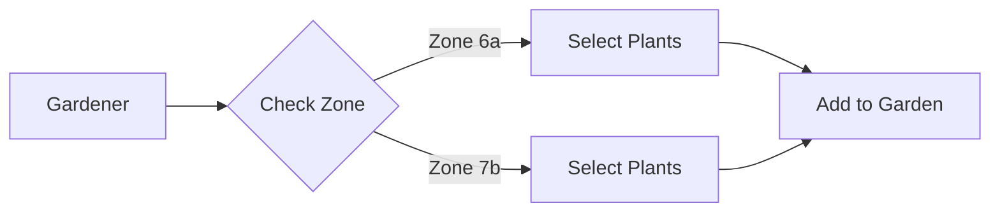
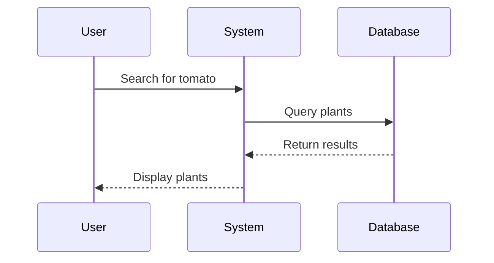
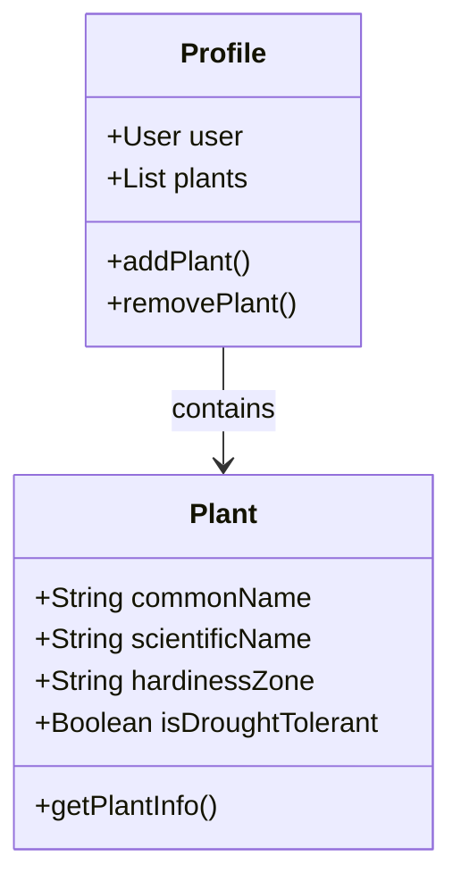
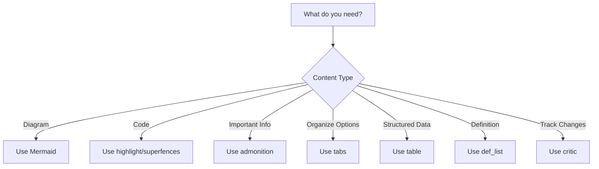

# MkDocs Extensions Guide

This guide explains all the markdown extensions enabled in this documentation site and how to use them effectively.

!!! info "Installation Required"
    Before using these extensions, install all required packages: **[MkDocs Installation Guide](mkdocs-installation.md)**

---

## Table of Contents Extensions

### `toc` - Table of Contents

Automatically generates table of contents from page headings.

**Configuration:**
```yaml
- toc:
    permalink: "#"      # Adds clickable anchor links to headings
    toc_depth: 3        # Include h1, h2, h3 in TOC (excludes h4, h5, h6)
```

**Usage:**
```markdown
# Heading 1
## Heading 2
### Heading 3
```

Each heading automatically gets an anchor link you can click to get a direct URL.

---

## Code Highlighting Extensions

### `pymdownx.highlight` - Syntax Highlighting

Provides beautiful syntax highlighting for code blocks.

**Example:**
```python
def calculate_zone(temperature):
    """Calculate USDA hardiness zone from temperature."""
    if temperature < -60:
        return "1a"
    elif temperature < -55:
        return "1b"
    # ... more logic
    return "13b"
```

**Features:**
- Line numbers with `anchor_linenums: true`
- Line highlighting
- Language-specific syntax coloring

### `pymdownx.inlinehilite` - Inline Code Highlighting

Highlight code within text: `:::python print("Hello")` renders as syntax-highlighted inline code.

**Example:**
The function `:::python def my_func():` does something important.

### `pymdownx.snippets` - Code Snippet Inclusion

Include code from external files directly into documentation.

**Example:**
```markdown
--8<-- "path/to/code.py"
```

From [here](https://facelessuser.github.io/pymdown-extensions/extensions/snippets/#snippet-sections) you can also specify sections:

```text
--8<-- "include.md:name"

--8<--
include.md:name
--8<--
```

### `pymdownx.superfences` - Advanced Code Blocks

Enables nested code blocks and custom fences like Mermaid diagrams.

---

## Diagram Support

### Mermaid Diagrams

Create diagrams directly in markdown using Mermaid syntax.

**Example - Flowchart:**


**Example - Sequence Diagram:**


**Example - Class Diagram:**


**Supported Diagram Types:**
- Flowcharts (`graph`)
- Sequence diagrams (`sequenceDiagram`)
- Class diagrams (`classDiagram`)
- State diagrams (`stateDiagram`)
- Entity Relationship diagrams (`erDiagram`)
- Gantt charts (`gantt`)
- Pie charts (`pie`)
- Git graphs (`gitGraph`)

**Learn More:** [Mermaid Documentation](https://mermaid.js.org/)

---

## Content Organization Extensions

### `pymdownx.tabbed` - Tabbed Content

Create tabbed content blocks for organizing related information.

**Example:**
```markdown
=== "Web Interface"
    Access the plant search from the main navigation menu.

=== "Mobile App"
    Tap the search icon in the bottom navigation bar.

=== "API"
    ```bash
    curl https://api.example.com/plants?zone=6a
    ```
```

**Renders as:**

=== "Web Interface"
    Access the plant search from the main navigation menu.

=== "Mobile App"
    Tap the search icon in the bottom navigation bar.

=== "API"
    ```bash
    curl https://api.example.com/plants?zone=6a
    ```

---

## Admonitions & Callouts

### `admonition` - Callout Boxes

Create attention-grabbing callout boxes.

**Available Types:**

!!! note "Note"
    This is a note - use for general information.

!!! tip "Tip"
    This is a tip - use for helpful suggestions.

!!! warning "Warning"
    This is a warning - use for important caveats.

!!! danger "Danger"
    This is a danger alert - use for critical warnings.

!!! example "Example"
    This is an example - use for code examples or demonstrations.

!!! quote "Quote"
    This is a quote - use for citations or references.

!!! success "Success"
    This is a success message - use for confirmations.

!!! info "Information"
    This is an info box - use for supplementary information.

!!! question "Question"
    This is a question - use for FAQs or clarifications.

!!! bug "Bug"
    This is a bug alert - use for known issues.

**Syntax:**
```markdown
!!! note "Custom Title"
    Content goes here.
    Can be multiple paragraphs.
```

**Custom Plant Tip** (with custom CSS):
```markdown
!!! plant-tip "Plant Tip"
    Tomatoes need 6-8 hours of full sun daily.
```

### `pymdownx.details` - Collapsible Admonitions

Make admonitions collapsible to save space.

**Example:**
```markdown
??? question "How do I determine my USDA zone?"
    Click here to expand and see the answer.

    Your USDA hardiness zone is based on your location's average annual minimum temperature.
```

**Renders as:**

??? question "How do I determine my USDA zone?"
    Click here to expand and see the answer.

    Your USDA hardiness zone is based on your location's average annual minimum temperature.

**Start Expanded:**
```markdown
???+ tip "Pro Tip"
    This starts open but can be collapsed.
```

---

## Table Extensions

### `tables` - Enhanced Tables

Create beautiful, responsive tables.

**Example:**
```markdown
| Plant | Zone | Sun | Water |
|-------|------|-----|-------|
| Tomato | 3-11 | Full | Medium |
| Lettuce | 2-11 | Partial | High |
| Basil | 10-11 | Full | Medium |
```

**Renders as:**

| Plant | Zone | Sun | Water |
|-------|------|-----|-------|
| Tomato | 3-11 | Full | Medium |
| Lettuce | 2-11 | Partial | High |
| Basil | 10-11 | Full | Medium |

**Alignment:**
```markdown
| Left-aligned | Center-aligned | Right-aligned |
|:-------------|:--------------:|--------------:|
| Content      | Content        | Content       |
```

### `mkdocs-table-reader-plugin` - Import Tables from External Files

View this extension's documentation [here](https://timvink.github.io/mkdocs-table-reader-plugin/). Learn how to use it to create reproducible reports via [here](https://timvink.nl/blog/reproducible-reports-with-mkdocs/).

Include tables directly from CSV, Excel, or other data files into your documentation.

**Installation:**
```bash
uv add mkdocs-table-reader-plugin
```

**Configuration in mkdocs.yml:**
```yaml
plugins:
  - table-reader
```

**Basic Usage - CSV Files:**
```markdown
{{ read_csv('path/to/data.csv') }}
```

**Basic Usage - Excel Files:**
```markdown
{{ read_excel('path/to/spreadsheet.xlsx') }}
```

**Read Specific Excel Sheet:**
```markdown
{{ read_excel('path/to/spreadsheet.xlsx', sheet_name='Sheet1') }}
```

**Advanced Options:**
```markdown
<!-- Include only specific columns -->
{{ read_csv('data.csv', usecols=['Name', 'Zone', 'Type']) }}

<!-- Skip rows -->
{{ read_csv('data.csv', skiprows=2) }}

<!-- Use specific encoding -->
{{ read_csv('data.csv', encoding='utf-8') }}

<!-- Read Excel with specific range -->
{{ read_excel('data.xlsx', sheet_name='Plants', usecols='A:D') }}
```

**Example - Decision Matrix:**
```markdown
## Project Decisions

The following decision matrix was used to evaluate our options:

{{ read_excel('../../decisions/CESYS524_decision-matrix_kkeeton.xlsx') }}
```

**Features:**
- Automatically converts CSV/Excel to markdown tables
- Supports pandas DataFrame operations
- Updates automatically when source files change
- No need to manually maintain duplicate table data
- Supports filtering, column selection, and formatting

**Use Cases:**
- Decision matrices and trade-off analyses
- Quality Function Deployment (QFD) matrices
- FMEA (Failure Mode and Effects Analysis) tables
- N-squared charts and interface matrices
- Any tabular data stored in external files

**Learn More:** [mkdocs-table-reader-plugin Documentation](https://timvink.github.io/mkdocs-table-reader-plugin/)

---

## Styling Extensions

### `attr_list` - Add CSS Classes

Add custom CSS classes and attributes to elements.

**Example:**
```markdown
{ .plant-image }

{.zone-badge}
Zone 6a
```

### `md_in_html` - Markdown Inside HTML

Use markdown syntax inside HTML blocks.

**Example:**
```html
<div class="feature-card">

## Feature Title

- Markdown list item
- Another item

</div>
```

### `pymdownx.emoji` - Emoji Support

Use emojis via shortcodes.

**Examples:**
- `:seedling:` → 🌱
- `:sunflower:` → 🌻
- `:cactus:` → 🌵
- `:herb:` → 🌿
- `:bouquet:` → 💐
- `:cherry_blossom:` → 🌸

**Search emojis:** [Emoji Cheat Sheet](https://github.com/ikatyang/emoji-cheat-sheet)

---

## Task List Extensions

### `pymdownx.tasklist` - Interactive Checkboxes

Create task lists with checkboxes.

**Example:**
```markdown
- [x] Choose planting location
- [x] Test soil pH
- [ ] Purchase seeds
- [ ] Plant seeds
- [ ] Water regularly
```

**Renders as:**

- [x] Choose planting location
- [x] Test soil pH
- [ ] Purchase seeds
- [ ] Plant seeds
- [ ] Water regularly

---

## List Extensions

### `def_list` - Definition Lists

Create glossary-style definition lists.

**Example:**
```markdown
USDA Hardiness Zone
:   A geographic area defined by average annual minimum temperature, used to determine which plants can survive in a location.

Full Sun
:   6 or more hours of direct sunlight per day.

Partial Shade
:   3-6 hours of direct sunlight per day.
```

**Renders as:**

USDA Hardiness Zone
:   A geographic area defined by average annual minimum temperature, used to determine which plants can survive in a location.

Full Sun
:   6 or more hours of direct sunlight per day.

Partial Shade
:   3-6 hours of direct sunlight per day.

---

## Reference Extensions

### `abbr` - Abbreviations

Define abbreviations with tooltips.

**Example:**
```markdown
The USDA defines plant hardiness zones.

*[USDA]: United States Department of Agriculture
```

When you hover over "USDA", you'll see the full definition.

### `footnotes` - Footnotes

Add footnotes to content.

**Example:**
```markdown
Plants in zone 6a can survive temperatures down to -10°F[^1].

[^1]: USDA Plant Hardiness Zone Map, 2012 revision
```

**Renders as:**

Plants in zone 6a can survive temperatures down to -10°F[^1].

[^1]: USDA Plant Hardiness Zone Map, 2012 revision

---

## Typography Extensions

### `pymdownx.smartsymbols` - Smart Symbols

Automatically converts text to proper symbols.

**Conversions:**
- `(c)` → ©
- `(r)` → ®
- `(tm)` → ™
- `c/o` → ℅
- `+/-` → ±
- `-->` → →
- `<--` → ←
- `<-->` → ↔
- `=/=` → ≠

### `pymdownx.keys` - Keyboard Keys

Display keyboard shortcuts beautifully.

**Example:**
```markdown
Press ++ctrl+alt+delete++ to restart.
Press ++cmd+s++ to save.
```

**Renders as:**

Press ++ctrl+alt+delete++ to restart.

---

## Review Extensions

### `pymdownx.critic` - Track Changes

Mark up content for review with track-changes style markup.

**Syntax:**
```markdown
This is {--deleted text--}.
This is {++added text++}.
This is {~~old~>new~~} text.
This is {==highlighted==} text.
{>>This is a comment<<}
```

**Renders as:**

This is {--deleted text--}.
This is {++added text++}.
This is {~~old~>new~~} text.
This is {==highlighted==} text.
{>>This is a comment<<}

---

## Math Extensions

### `pymdownx.arithmatex` - Mathematical Expressions

Write mathematical formulas using LaTeX syntax.

**Inline Math:**
```markdown
The area of a circle is $A = \pi r^2$.
```

**Block Math:**
```markdown
$$
\frac{-b \pm \sqrt{b^2 - 4ac}}{2a}
$$
```

**Example - Growing Calculations:**
```markdown
Plant spacing: $S = \frac{L}{n-1}$ where L is length and n is number of plants.
```

---

## Best Practices

### When to Use Each Extension

**Admonitions:**
- Use `note` for general information
- Use `warning` for important caveats
- Use `tip` for helpful suggestions
- Use `example` for code demonstrations

**Diagrams:**
- Use flowcharts for process flows
- Use sequence diagrams for API interactions
- Use class diagrams for data models
- Use entity-relationship diagrams for database schemas

**Tabs:**
- Use for multiple implementations (web vs mobile)
- Use for different user roles (admin vs user)
- Use for multiple code examples (Python vs JavaScript)

**Tables:**
- Use for structured data (plant characteristics)
- Use for comparison (feature matrices)
- Keep tables simple - complex tables are hard to read on mobile

### Accessibility Considerations

1. **Always provide alt text for images:**
   ```markdown
   
   ```

2. **Use semantic heading structure:**
   - Don't skip heading levels (h1 → h3)
   - Use h1 only once per page

3. **Make link text descriptive:**
   - ❌ `[Click here](link)` for more information
   - ✅ `[Learn about USDA zones](link)` for detailed information

4. **Use proper table headers:**
   ```markdown
   | Plant Name | Zone | Spacing |
   |------------|------|---------|
   | Tomato     | 3-11 | 24-36"  |
   ```

---

## Image Processing (Quick Reference)

This documentation uses two plugins for optimal image handling.

### Automatic Image Optimization

All images are automatically compressed during build - no special syntax needed.

**Just add images normally:**
```markdown

```

The optimize plugin automatically:
- Compresses PNG/JPG files (30-70% size reduction)
- Strips metadata
- Generates WebP versions
- Caches results for faster rebuilds

### Click-to-Zoom Lightbox

All images automatically get click-to-zoom functionality.

**Basic usage (auto-enabled):**
```markdown

```

Click image to open lightbox. Use arrow keys or swipe to navigate.

**Disable lightbox for specific images:**
```markdown
{ .skip-lightbox }
```

**Create image gallery:**
```markdown


```

Multiple images become a navigable gallery. Click any image, then use ← → arrows or swipe.

**Keyboard shortcuts in lightbox:**
- `←` / `→` - Navigate gallery
- `Esc` - Close
- `+` / `-` - Zoom in/out

!!! info "Installation & Configuration"
    For setup instructions, system dependencies, and troubleshooting, see:
    **[Image Processing Setup Guide](image-processing-setup.md)**

---

## Custom Extensions (Project-Specific)

### Zone Badges

Use custom CSS class for zone badges:

```html
<span class="zone-badge">Zone 6a</span>
```

### Status Badges

Use for requirement/specification status:

```html
<div class="status-badge draft">Draft</div>
<div class="status-badge review">In Review</div>
<div class="status-badge approved">Approved</div>
<div class="status-badge implemented">Implemented</div>
```

### Feature Cards

Use for highlighting features:

```html
<div class="feature-card">

## Plant Search

Search thousands of plants by name, zone, characteristics, and more.

</div>
```

---

## Additional Resources

- [Material for MkDocs Reference](https://squidfunk.github.io/mkdocs-material/reference/)
- [PyMdown Extensions Documentation](https://facelessuser.github.io/pymdown-extensions/)
- [Python Markdown Documentation](https://python-markdown.github.io/)
- [Mermaid Live Editor](https://mermaid.live/) - Test diagrams

---

## Need Help?

If you're unsure which extension to use, refer to this decision tree:



---

**Last Updated:** 2025-12-12
**Maintained By:** Gardening App Documentation Team
