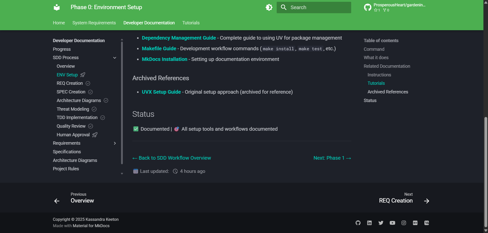

# Page Navigation Styling with CSS

## Purpose

This tutorial demonstrates how to create custom page navigation elements (Previous/Next links) using CSS flexbox and secure HTML anchor tags.

## Use Case



When you need custom navigation that:

- Aligns left and right (not centered)
- Uses flexbox for responsive layout
- Maintains security with proper `rel` attributes
- Integrates with MkDocs Material theme

## Implementation

### 1. Create the CSS Class

Add a CSS class to `docs/stylesheets/extra.css`:

```css
/* ========================================
   Phase Navigation
   ======================================== */

/* Navigation for workflow phase pages - left/right alignment */
.phase-nav {
  display: flex;
  justify-content: space-between;
  margin-top: 2rem;
}
```

**What it does:**

- `display: flex` - Enables flexbox layout
- `justify-content: space-between` - Pushes items to edges (left/right alignment)
- `margin-top: 2rem` - Adds spacing above navigation

### 2. Use HTML Anchor Tags with Security Attributes

In your markdown file, use HTML structure with the CSS class:

```html
<div class="phase-nav">
  <span><a href="previous-page.md" rel="noopener noreferrer">← Previous: Phase 1</a></span>
  <span><a href="next-page.md" rel="noopener noreferrer">Next: Phase 3 →</a></span>
</div>
```

**CRITICAL SECURITY RULES:**

1. **ALWAYS include `rel="noopener noreferrer"`** on ALL `<a href>` tags
2. **ONLY use `target="_blank"`** for external links (different domains)
3. **Internal links** should NOT use `target="_blank"`

**Why `rel="noopener noreferrer"`?**

- `noopener` - Prevents the new page from accessing `window.opener` (tabnabbing prevention)
- `noreferrer` - Prevents the browser from sending the referrer header
- Defense-in-depth approach - include on ALL links for consistency

### 3. Pattern Variations

**First page** (Back to Overview + Next):

```html
<div class="phase-nav">
  <span><a href="../overview.md" rel="noopener noreferrer">← Back to Overview</a></span>
  <span><a href="next-page.md" rel="noopener noreferrer">Next: Phase 1 →</a></span>
</div>
```

**Middle page** (Previous + Next):

```html
<div class="phase-nav">
  <span><a href="previous-page.md" rel="noopener noreferrer">← Previous: Phase 1</a></span>
  <span><a href="next-page.md" rel="noopener noreferrer">Next: Phase 3 →</a></span>
</div>
```

**Last page** (Previous + Back to Overview):

```html
<div class="phase-nav">
  <span><a href="previous-page.md" rel="noopener noreferrer">← Previous: Phase 6</a></span>
  <span><a href="../overview.md" rel="noopener noreferrer">Back to Overview</a></span>
</div>
```

## Why Not Use Markdown Links?

Markdown links inside HTML tags don't get processed by MkDocs:

```html
<!-- ❌ WRONG: Markdown links inside HTML are treated as plain text -->
<div class="phase-nav">
  <span>[← Previous](page.md)</span>
  <span>[Next →](page.md)</span>
</div>
```

This renders as literal text `[← Previous](page.md)` instead of clickable links.

**Solution**: Use HTML anchor tags throughout the HTML structure.

## Why Not Use Inline Styles?

Inline styles work but have disadvantages:

```html
<!-- ❌ AVOID: Inline styles (less secure, harder to maintain) -->
<div style="display: flex; justify-content: space-between;">
  <span><a href="page.md">Previous</a></span>
  <span><a href="page.md">Next</a></span>
</div>
```

**Problems:**

- **Security**: Some Content Security Policies (CSP) block inline styles
- **Maintainability**: Changes require updating every file
- **Consistency**: Easy to have variations across files

**CSS classes are better:**

- ✅ More secure (CSP-friendly)
- ✅ Single point of update (DRY principle)
- ✅ Consistent styling across all pages
- ✅ Easier to read and maintain

## External Links

For external links, add `target="_blank"`:

```html
<div class="phase-nav">
  <span><a href="internal.md" rel="noopener noreferrer">← Previous</a></span>
  <span><a href="https://example.com" target="_blank" rel="noopener noreferrer">External Resource →</a></span>
</div>
```

**Rule**: `target="_blank"` ONLY for external links (different domains).

## Real-World Examples

See implementation in:

- `docs/workflow/phase0-environment-setup.md`
- `docs/workflow/phase1-requirements-creation.md`
- `docs/workflow/phase2-specification-generation.md`
- All phase files (`phase0-phase7`) use this pattern

## Related Documentation

- **Markdown Standards**: `docs/rules/markdown-standards.md` - HTML link security standards
- **CSS Styling**: `docs/stylesheets/extra.css` - `.phase-nav` class definition
- **CLAUDE.md**: `.claude/CLAUDE.md` - Critical rules including HTML link security

## Summary

**To create secure, maintainable page navigation:**

1. Create a CSS class in `docs/stylesheets/extra.css`
2. Use HTML `<div>` and `<a>` tags (not markdown links)
3. ALWAYS include `rel="noopener noreferrer"` on ALL links
4. ONLY use `target="_blank"` for external links
5. Use flexbox (`justify-content: space-between`) for left/right alignment
