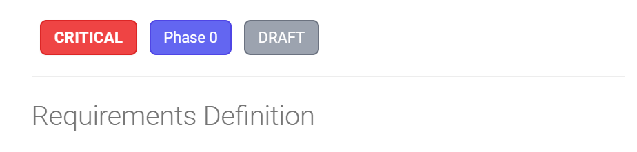

# Priority Badges Setup Guide

This guide shows you how to enable and use priority badges in your MkDocs documentation site.

## What You Get

Priority badges automatically display on requirement pages, showing:

- ✅ **Priority level** (CRITICAL, HIGH, MEDIUM, LOW) with color-coded badges
- ✅ **Phase number** (1-7) for implementation tracking
- ✅ **Status** (Draft, In Review, Approved, Implemented)

## Visual Preview

### On Requirement Pages

When you view a requirement page, badges appear right after the title:

```
# Plant Database

[CRITICAL] [Phase 0] [Approved]

Plant data model, storage, and basic display...
```

**Visual appearance:**

{ .bordered }

*The CRITICAL badge appears in red, Phase in blue, and Approved (status) in green.*

### Color Scheme

| Priority | Color | When to Use |
|----------|-------|-------------|
| **CRITICAL** | 🔴 Red | Foundation features blocking other work |
| **HIGH** | 🟠 Orange | Core functionality needed for MVP |
| **MEDIUM** | 🟡 Yellow | Important features that can be phased |
| **LOW** | 🟢 Green | Nice-to-have, deferred to later |

### On Index Pages

The requirements index shows all requirements in cards with badges:

<div class="ascii-art">

```text
┌─────────────────────────────────────────────────────────┐
│ Plant Database              [CRITICAL] [Phase 1]        │
├─────────────────────────────────────────────────────────┤
│ Plant data model, storage, and basic display.           │
│ Foundation for entire system.                           │
│                                                         │
│ View Requirement →                                      │
└─────────────────────────────────────────────────────────┘
```

</div>

## Setup Instructions

### Step 1: Files Already Created ✅

These files have been created for you:

- `docs/stylesheets/priority-badges.css` - Badge styling
- `docs/hooks/priority_badges.py` - Auto-injection hook
- `docs/rules/requirement-metadata-guide.md` - Usage guide
- `mkdocs.yml` - Already configured

### Step 2: Update Requirement Template

Add YAML front matter to your requirement files:

```yaml
---
title: "Plant Database"
req_id: "req-general-user-plant-database"
priority: "CRITICAL"
phase: "1"
status: "approved"
created: "2025-01-15"
updated: "2025-01-27"
author: "Kassandra Keeton"
maps_to_req000: "System.GenUser.ViewsAndInsights.PlantDatabase"
---
```

**This is already in the template** at `docs/templates/requirements-template.md`!

### Step 3: Build and View

```bash
# Serve locally to preview badges
mkdocs serve

# Build for production
mkdocs build

# Deploy to GitHub Pages
mkdocs gh-deploy
```

### Step 4: View Example

Visit the example page to see badges in action:

- Local: `http://localhost:8000/requirements/requirements-index-example/`
- Live: `https://prosperousheart.github.io/gardening-app/requirements/requirements-index-example/`

## How It Works

### Automatic Badge Injection

There are 2 approaches: Hook vs Macros

!!! warning "Known Issue: Hook May Not Work on All Files"
    The Python hook approach works on some files but **not on REQ-000 files**.
    The root cause is unknown. We currently use the **macros plugin approach** as a workaround.

#### Approach 1: Python Hook (Intended, But May Not Work)

The `priority_badges.py` hook is **supposed to**:

1. **Read** the YAML front matter from requirement files
2. **Detect** priority, phase, and status values
3. **Inject** HTML badges after the first H1 heading
4. **Style** badges using `priority-badges.css`

**Issue:** For unknown reasons, badges don't appear on REQ-000 files even though the hook runs.

#### Approach 2: Macros Plugin (Current Workaround)

**Requirements:**
- `mkdocs-macros-plugin` must be enabled in `mkdocs.yml`
- Jinja2 template code must be **directly in each file** (NOT via snippets!)

**How it works:**

1. **YAML Front Matter** - Metadata at top of file
2. **Jinja2 Template** - Reads metadata and generates HTML
3. **Macros Plugin** - Processes Jinja2 during build
4. **CSS Styling** - `priority-badges.css` styles the badges

!!! danger "CRITICAL: Snippets + Jinja2 Don't Work"
    **Execution order:**

    1. ✅ Markdown extensions (including `pymdownx.snippets`) run FIRST
    2. ✅ Plugins (including `mkdocs-macros-plugin`) run SECOND

    If you include Jinja2 via snippets, it becomes **literal text** before the macros plugin runs.
    You'll see raw `` on the page.

    **Solution:** Put Jinja2 code directly in each requirement file.

### Example Transformation

**Before (markdown):**

```markdown
---
priority: "CRITICAL"
phase: "1"
status: "approved"
---

# Plant Database

Plant data model...
```

**After (rendered HTML):**
```html
<h1>Plant Database</h1>

<div class="requirement-badges">
  <span class="priority-badge priority-critical">CRITICAL</span>
  <span class="phase-badge">Phase 1</span>
  <span class="status-badge status-approved">Approved</span>
</div>

<p>Plant data model...</p>
```

### Macros Approach Template

**Complete example with Jinja2 template:**


```markdown
---
priority: "CRITICAL"
phase: "1"
status: "approved"
---

# Plant Database


<div class="requirement-badges">
<span class="priority-badge priority-{{ page.meta.priority | lower }}">{{ page.meta.priority }}</span>
<span class="phase-badge">Phase {{ page.meta.phase }}</span>
<span class="status-badge status-{{ page.meta.status | replace(' ', '-') | lower }}">{{ page.meta.status | replace('-', ' ') | title }}</span>
</div>


Plant data model, storage, and basic display.
```


**This template:**

- Checks if `page.meta.priority` exists
- Generates priority badge with correct CSS class (lowercase)
- Conditionally adds phase and status badges if present
- Uses Jinja2 filters for formatting

## Creating a Requirements Index

You can create an auto-generated requirements index:

### Option 1: Manual Index (Simple)

Create `docs/requirements/index.md`:

```markdown
# Requirements Index

## Phase 1: Core Plant Database

- [Plant Database](req-general-user-plant-database.md) - CRITICAL
- [Plant Search](req-general-user-plant-search.md) - CRITICAL
```

### Option 2: Python Script (Advanced)

Create a script to auto-generate the index:

```python
#!/usr/bin/env python3
"""Generate requirements index from YAML front matter."""

import yaml
from pathlib import Path

def generate_index():
    req_dir = Path("docs/requirements")
    requirements = []

    # Read all requirement files
    for req_file in req_dir.glob("req-*.md"):
        with open(req_file, "r") as f:
            content = f.read()

            # Extract YAML front matter
            if content.startswith("---"):
                yaml_end = content.find("---", 3)
                yaml_content = content[3:yaml_end]
                metadata = yaml.safe_load(yaml_content)

                requirements.append({
                    "file": req_file.name,
                    "title": metadata.get("title"),
                    "priority": metadata.get("priority"),
                    "phase": metadata.get("phase"),
                    "status": metadata.get("status"),
                })

    # Sort by phase, then priority
    priority_order = {"CRITICAL": 0, "HIGH": 1, "MEDIUM": 2, "LOW": 3}
    requirements.sort(
        key=lambda r: (int(r["phase"]), priority_order.get(r["priority"], 4))
    )

    # Generate markdown
    output = ["# Requirements Index\n"]

    current_phase = None
    for req in requirements:
        phase = req["phase"]
        if phase != current_phase:
            output.append(f"\n## Phase {phase}\n")
            current_phase = phase

        output.append(
            f'- [{req["title"]}]({req["file"]}) '
            f'<span class="priority-badge priority-{req["priority"].lower()}">'
            f'{req["priority"]}</span>\n'
        )

    # Write index file
    with open("docs/requirements/index.md", "w") as f:
        f.write("".join(output))

    print("✅ Generated docs/requirements/index.md")

if __name__ == "__main__":
    generate_index()
```

Run before building:
```bash
python scripts/generate-req-index.py
mkdocs build
```

### Option 3: MkDocs Plugin (Most Advanced)

Install `mkdocs-macros-plugin`:

```bash
uv add mkdocs-macros-plugin
```

Configure in `mkdocs.yml`:

```yaml
plugins:
  - macros:
      module_name: docs/macros/requirements_index
```

Create `docs/macros/requirements_index.py`:

```python
def define_env(env):
    """Define macros for MkDocs."""

    @env.macro
    def requirements_by_priority(priority):
        """Get all requirements with given priority."""
        requirements = []
        # ... (similar logic to script above)
        return requirements
```

Use in markdown:


```markdown
# Critical Priority Requirements


- [{{ req.title }}]({{ req.file }})

```


## Customization

### Change Badge Colors

Edit `docs/stylesheets/priority-badges.css`:

```css
/* CRITICAL - Change red to a different color */
.priority-critical {
    background-color: #dc2626;  /* Change this */
    color: #ffffff;
    border: 2px solid #b91c1c;  /* And this */
}
```

### Add New Statuses

Add new status badge styles:

```css
.status-on-hold {
    background-color: #f59e0b;
    color: #ffffff;
    border: 2px solid #d97706;
}
```

Then use in YAML:

```yaml
status: "on-hold"
```

### Disable Badges for Specific Pages

**Step 1: Add to YAML front matter** (same for both approaches):

```yaml
---
title: "My Requirement"
priority: "CRITICAL"
show_badges: false  # Add this to disable badges
---
```

**Step 2: Update implementation** (differs by approach):

#### For Macros Plugin Approach (Current)

Update the Jinja2 template in your requirement file:


```jinja

<div class="requirement-badges">
<span class="priority-badge priority-{{ page.meta.priority | lower }}">{{ page.meta.priority }}</span>
<span class="phase-badge">Phase {{ page.meta.phase }}</span>
<span class="status-badge status-{{ page.meta.status | replace(' ', '-') | lower }}">{{ page.meta.status | replace('-', ' ') | title }}</span>
</div>

```


**Change:** `` → ``

#### For Python Hook Approach

Update `priority_badges.py`:

```python
def on_page_markdown(markdown, page, config, files):
    # Check if badges are disabled
    if page.meta.get("show_badges") == False:
        return markdown
    # ... rest of code
```

## Troubleshooting

### Badges Not Showing

1. **Check YAML front matter format:**
   ```yaml
   ---
   priority: "CRITICAL"  # ✅ Correct (quoted)
   priority: CRITICAL    # ❌ May not work
   ---
   ```

2. **Verify CSS is loaded:**
   - Open browser dev tools
   - Check Network tab for `priority-badges.css`
   - Should return 200 status code

3. **Check hook is running:**
   ```bash
   mkdocs serve --verbose
   # Look for: "Loading hook: docs/hooks/priority_badges.py"
   ```

### Badges Styling Wrong

1. **Clear browser cache:** Ctrl+Shift+R (Windows/Linux) or Cmd+Shift+R (Mac)

2. **Check CSS specificity:** Your theme's CSS may override badge styles

3. **Increase specificity:**
   ```css
   /* More specific selector */
   .md-content .priority-badge.priority-critical {
       background-color: #ef4444 !important;
   }
   ```

### Hook Not Running

1. **Check file location:**
   - Should be `docs/hooks/priority_badges.py`
   - **Not** `hooks/priority_badges.py`

2. **Check mkdocs.yml:**
   ```yaml
   hooks:
     - docs/hooks/priority_badges.py  # Must include 'docs/' prefix
   ```

3. **Restart MkDocs server:**
   - Stop: Ctrl+C
   - Start: `mkdocs serve`

## Next Steps

1. ✅ **View the example:** Visit `/requirements/requirements-index-example/`

2. ✅ **Create your first requirement:** Use the template with YAML front matter

3. ✅ **Build the site:** Run `mkdocs serve` to see badges

4. ✅ **Generate an index:** Use one of the three options above

5. ✅ **Customize colors:** Edit `priority-badges.css` to match your theme

## Resources

- **CSS File:** `docs/stylesheets/priority-badges.css`
- **Hook File:** `docs/hooks/priority_badges.py`
- **Template:** `docs/templates/requirements-template.md`
- **Example:** `docs/requirements/requirements-index-example.md`
- **Metadata Guide:** `docs/rules/requirement-metadata-guide.md`

---

**Questions?** Check the [Requirement Metadata Management Guide](../../rules/requirement-metadata-guide.md) for details on using YAML front matter.
