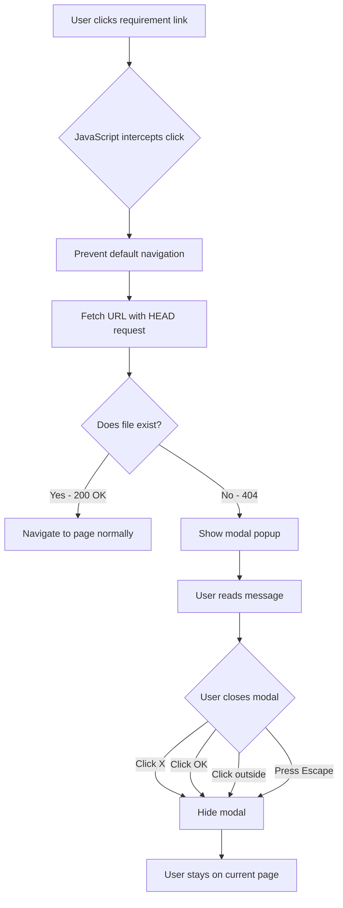

# Requirement Modal Popup Setup

**Tutorial: Creating a Custom Modal for Missing Requirements**

## Overview

This tutorial explains how to implement a custom modal popup that displays when users click on links to requirement documents that don't exist yet, instead of showing a 404 error page.

## The Problem

When building a documentation site for a project that's still in development, many requirement documents may not exist yet. When users click on these links, they encounter a jarring 404 error page, which creates a poor user experience.

## The Solution

We implemented a three-part solution:

1. **JavaScript modal handler** - Intercepts clicks on requirement links and checks if the file exists
2. **CSS styling** - Creates a beautiful, responsive modal popup
3. **Custom 404 page** - Fallback for direct navigation to missing pages

## Implementation

### Step 1: Create the JavaScript Handler

Create `docs/javascripts/requirement-modal.js`:

```javascript
// ABOUTME: Modal popup handler for missing requirement files
// ABOUTME: Intercepts requirement link clicks and shows friendly message instead of 404

document.addEventListener('DOMContentLoaded', function() {
    // Create modal HTML structure
    const modalHTML = `
        <div id="req-not-available-modal" class="req-modal">
            <div class="req-modal-content">
                <span class="req-modal-close">&times;</span>
                <div class="req-modal-header">
                    <!-- SVG icon -->
                    <h2>Requirement Not Available</h2>
                </div>
                <div class="req-modal-body">
                    <p>This requirement document is not currently available.</p>
                    <!-- Additional content -->
                </div>
                <div class="req-modal-footer">
                    <button class="req-modal-button req-modal-button-primary">OK</button>
                </div>
            </div>
        </div>
    `;

    // Insert modal into page
    document.body.insertAdjacentHTML('beforeend', modalHTML);

    // ... event listeners for showing/hiding modal
    // ... click interceptor for requirement links
});
```

**Key Features:**

- **Link Detection**: Intercepts clicks on any link matching `req-*.md` pattern
- **File Checking**: Uses `fetch()` with `HEAD` method to check if file exists
- **Smart Navigation**: If file exists, allows normal navigation; if not, shows modal
- **Multiple Close Methods**:
  - Click the X button
  - Click the OK button
  - Click outside the modal
  - Press Escape key
- **Accessibility**: Prevents body scroll when modal is open

### Step 2: Create the CSS Styling

Create `docs/stylesheets/requirement-modal.css`:

```css
/* Modal overlay */
.req-modal {
    display: none;
    position: fixed;
    z-index: 9999;
    left: 0;
    top: 0;
    width: 100%;
    height: 100%;
    background-color: rgba(0, 0, 0, 0.5);
    backdrop-filter: blur(4px);
    animation: fadeIn 0.3s ease-in-out;
}

/* Modal content */
.req-modal-content {
    background-color: var(--md-default-bg-color, #fff);
    margin: 10% auto;
    padding: 0;
    border-radius: 12px;
    width: 90%;
    max-width: 500px;
    box-shadow: 0 10px 40px rgba(0, 0, 0, 0.3);
    animation: slideDown 0.3s ease-in-out;
}

/* Animations */
@keyframes fadeIn {
    from { opacity: 0; }
    to { opacity: 1; }
}

@keyframes slideDown {
    from {
        transform: translateY(-50px);
        opacity: 0;
    }
    to {
        transform: translateY(0);
        opacity: 1;
    }
}
```

**Key Features:**

- **Theme Integration**: Uses MkDocs Material theme variables (`var(--md-default-bg-color)`)
- **Dark Mode Support**: Automatically adapts to theme color scheme
- **Smooth Animations**: Fade in overlay, slide down content
- **Responsive Design**: Mobile-friendly with media queries
- **Visual Hierarchy**: Clear header, body, footer structure

### Step 3: Create Custom 404 Page

Create `docs/404.md`:

```markdown
# Page Not Found

## Oops! This page doesn't exist

### If you're looking for a requirement document:

**This requirement may be:**

- Still being drafted
- Under review
- Scheduled for a future release

**What to do next:**

1. Check the Requirements Index
2. Visit the Requirements Overview
3. Contact the project team
```

This provides a fallback for users who navigate directly to missing pages (not through the modal).

### Step 4: Update MkDocs Configuration

Add the files to `mkdocs.yml`:

```yaml
extra_css:
  - stylesheets/requirement-modal.css  # Modal popup for missing requirements

extra_javascript:
  - javascripts/requirement-modal.js  # Modal handler for missing requirement files
```

## How It Works

### User Flow



### Technical Flow

1. **Page Load**: JavaScript inserts modal HTML into DOM (hidden)
2. **Click Event**: Event listener monitors all clicks on the page
3. **Link Detection**: Checks if clicked element is a link to `req-*.md`
4. **File Check**: Sends HEAD request to check if file exists
5. **Decision**:
   - **File exists**: Allow normal navigation
   - **File missing**: Show modal popup
6. **Close Actions**: Multiple ways to dismiss the modal

## Customization

### Change the Modal Message

Edit `docs/javascripts/requirement-modal.js` and modify the `modalHTML` variable:

```javascript
const modalHTML = `
    <div id="req-not-available-modal" class="req-modal">
        <div class="req-modal-content">
            <!-- Customize this content -->
            <div class="req-modal-body">
                <p>Your custom message here!</p>
            </div>
        </div>
    </div>
`;
```

### Change the Modal Colors

Edit `docs/stylesheets/requirement-modal.css`:

```css
.req-modal-icon {
    color: #your-color-here;
}

.req-modal-button-primary {
    background-color: #your-button-color;
}
```

### Change the Link Pattern

By default, the modal intercepts links matching `req-*.md`. To change this pattern, edit the JavaScript:

```javascript
// Current pattern
if (!href || !href.match(/req-.*\.md$/)) return;

// Example: Match spec-*.md instead
if (!href || !href.match(/spec-.*\.md$/)) return;

// Example: Match multiple patterns
if (!href || !href.match(/(req|spec)-.*\.md$/)) return;
```

### Add Additional Close Button

To add a "Go Back" button alongside the OK button:

```javascript
// In modalHTML
<div class="req-modal-footer">
    <button class="req-modal-button req-modal-button-secondary">Go Back</button>
    <button class="req-modal-button req-modal-button-primary">OK</button>
</div>
```

Then add event listener:

```javascript
const backBtn = modal.querySelector('.req-modal-button-secondary');
backBtn.addEventListener('click', function() {
    hideModal();
    window.history.back();
});
```

## Testing

### Local Testing

1. **Start MkDocs server**:
   ```bash
   mkdocs serve
   ```

2. **Navigate to requirements page**:
   ```
   http://127.0.0.1:8000/requirements/requirements-index-example/
   ```

3. **Click on requirement links**:
   - Links to existing files → Normal navigation
   - Links to missing files → Modal appears

4. **Test close methods**:
   - Click X button
   - Click OK button
   - Click outside modal
   - Press Escape key

### Browser Console Testing

Open browser console (F12) and test the modal programmatically:

```javascript
// Show modal
document.getElementById('req-not-available-modal').style.display = 'block';

// Hide modal
document.getElementById('req-not-available-modal').style.display = 'none';
```

### Test Different Screen Sizes

Use browser DevTools to test responsive design:

- Desktop (1920x1080)
- Tablet (768x1024)
- Mobile (375x667)

## Best Practices

### 1. Keep Modal Lightweight

The modal should load quickly and not impact page performance. Our implementation:

- Uses vanilla JavaScript (no dependencies)
- Minimal CSS (under 200 lines)
- No external resources to load

### 2. Maintain Accessibility

- Keyboard navigation (Escape to close)
- Focus management (modal content is focusable)
- Semantic HTML structure
- ARIA attributes (could be added for screen readers)

### 3. Provide Context

The modal message should:

- Explain why the requirement isn't available
- Suggest next steps
- Link to helpful resources

### 4. Test Thoroughly

Before deploying:

- Test on multiple browsers (Chrome, Firefox, Safari, Edge)
- Test on mobile devices
- Test with keyboard navigation
- Test with screen readers (for accessibility)

## Troubleshooting

### Modal Doesn't Appear

**Check console for errors**:
```bash
# Open browser console (F12)
# Look for JavaScript errors
```

**Verify files are loaded**:
```javascript
// In browser console
console.log('Modal script loaded');
```

### Modal Appears for Existing Files

The `fetch()` request might be failing. Check:

- Network tab in DevTools
- CORS settings
- File paths are correct

### Styling Doesn't Match Theme

Make sure you're using MkDocs Material theme variables:

```css
/* Use these variables */
var(--md-default-bg-color)
var(--md-default-fg-color)
var(--md-primary-fg-color)
var(--md-accent-fg-color)
```

### Modal Doesn't Close

Check event listeners are properly attached:

```javascript
// Add console logs for debugging
closeBtn.addEventListener('click', function() {
    console.log('Close button clicked');
    hideModal();
});
```

## Files Created

This feature consists of four files:

1. **`docs/javascripts/requirement-modal.js`** - Modal logic and event handling
2. **`docs/stylesheets/requirement-modal.css`** - Modal styling and animations
3. **`docs/404.md`** - Custom 404 page for direct navigation
4. **`mkdocs.yml`** - Updated configuration to include new files

## Benefits

✅ **Better UX** - No jarring 404 errors
✅ **Professional** - Polished, modern design
✅ **Informative** - Explains why content is unavailable
✅ **Accessible** - Keyboard navigation support
✅ **Responsive** - Works on all screen sizes
✅ **Theme-aware** - Matches site's light/dark mode
✅ **Performant** - Lightweight, no dependencies

## Next Steps

Consider enhancing the modal with:

1. **Status Tracking**: Show which requirements are "In Progress", "Under Review", etc.
2. **Notifications**: Allow users to subscribe to updates when requirement becomes available
3. **Search Integration**: Link to search results for similar requirements
4. **Analytics**: Track which missing requirements users are most interested in

## Related Documentation

- [MkDocs Material Theme](https://squidfunk.github.io/mkdocs-material/)
- [Priority Badges Setup](priority-badges-setup.md)
- [Requirements Index Demo](../../requirements/requirements-index-example.md)
- [Custom 404 Page](../../404.md)

## Conclusion

This modal system provides a professional, user-friendly way to handle missing requirement documents during active development. It's lightweight, customizable, and integrates seamlessly with the MkDocs Material theme.
