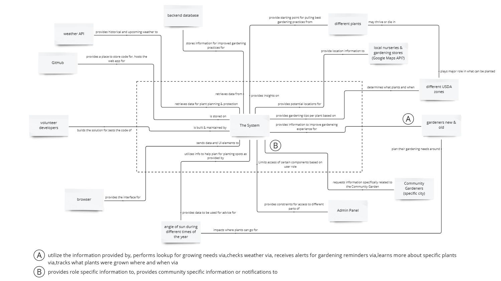

# Scope

Learn more about this project [here](index.md#project-description).

---

!!! info "Full Version Available"
Current full & updated version of this page is currently in the works & can be found <a href="https://docs.google.com/document/d/1decYpeZlxtQeLBvPupJ2VFWPRHVlUZnn/edit?usp=sharing&ouid=114844884846337292418&rtpof=true&sd=true" target="_blank">here</a>.

## Context Diagrams

Below is the initial context diagram created as part my work in Cornell's [CESYS521 Defining Scope](https://ecornell.cornell.edu/courses/project-leadership-and-systems-design/defining-scope/) course.

### Main General Use Context Diagram

This can be found [here](https://miro.com/app/board/uXjVLFJo2wg=/?moveToWidget=3458764606881791930&cot=14).

### Community Gardener Specific Context Diagram

This can be found [here](https://miro.com/app/board/uXjVLFJo2wg=/?moveToWidget=3458764607139220750&cot=14).

## Scenarios to Consider

In alignment with the [original ideation](/gardening-docs/docs/index.md#original-scenarios--needs), the following are scenarios written as prep for use cases relating to the system.

1. Automatically receiving weather alerts when certain thresholds are hit

2. Checking planting dates as estimated by the system based on USDA zone

3. Viewing historical weather data for local area

4. Viewing the system options

5. Adding plants to the system

6. Finding local nurseries and gardening supply stores via the system

7. Viewing angle of the sun based on time of year and location

8. Viewing plant data in the system

9. Searching the system for plants to grow based on different criteria

10. Updating plant data in the system

11. Deleting plant data in the system

12. Tracking what plants were planted where (e.g.: front yard) and when via the system

13. Viewing companion plants as outlined in the system

14. Updating companion plant data in the system

15. Adding your current location in the system (if not using GPS)

16. Viewing growing / gardening tips via the system (per plant, general care, etc)

17. Providing feedback on the system

18. Submitting bug issues in the system

19. Emailing plant data to someone via the system

20. Finding companion plants for specific plants via the system

21. Providing helpful hints when “errors” happen in the system

22. Provides access to training modules (PCG only)

23. Provides training progress to gardening mentors

## Use Cases

You can review the user cases [here](files/Use_Cases.pdf).

## Use Case Diagrams

TBD

### General System User

TBD

### General User Weather Component

TBD

### General User Saving Plants Component

TBD

### System Admin, Community Lead, Educator

TBD

### Gardener Community Role (Member)

TBD

### Gardener Role Assignment (Team or Chore Assigned)

TBD

### Community Gardener Component (Plots)

TBD

## Scope Tree

TBD

### TheSystem

TBD

### TheSystem.GeneralUser

TBD

### TheSystem.AdminAccess

TBD

### TheSystem.CommunityMember

TBD
